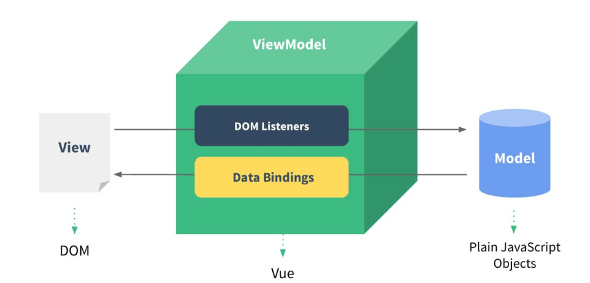
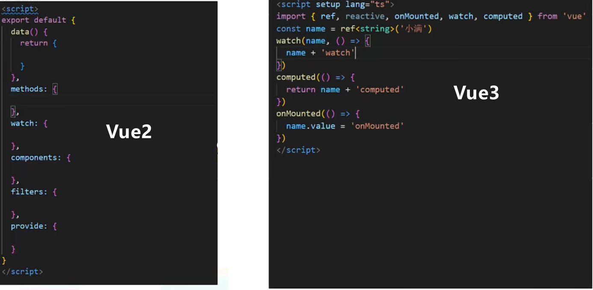
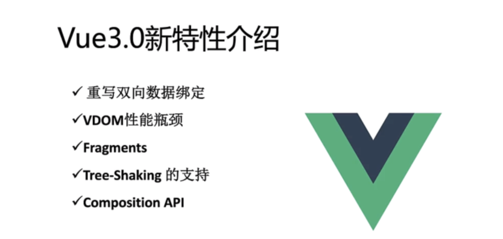
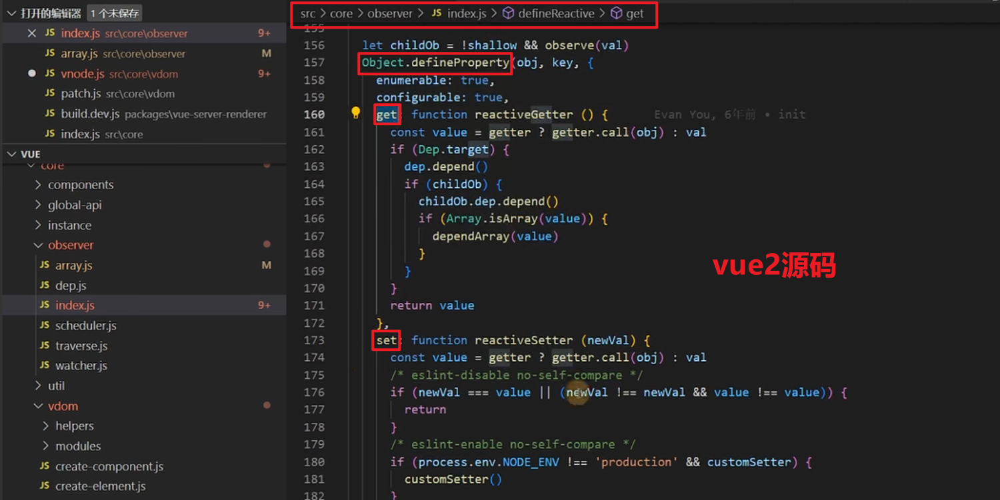
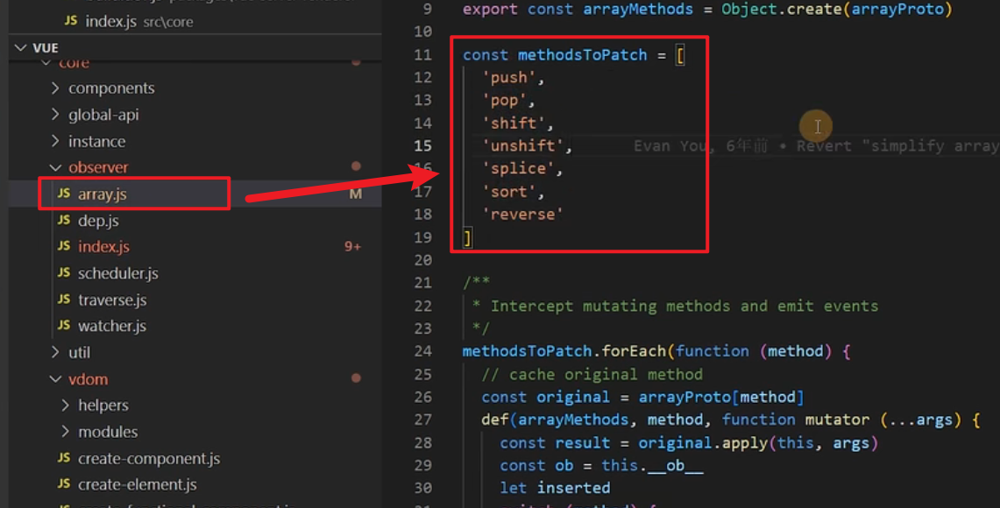
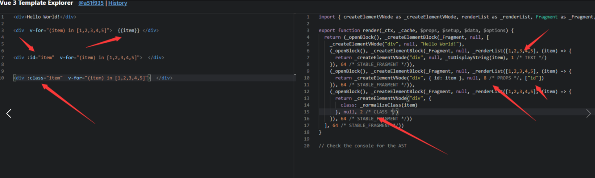

# 1_Vue3概述-梦开始的地方

::: tip 

Vue (读音 /vjuː/，类似于 view) 是一套用于构建用户界面的渐进式框架。与其它大型框架不同的是，Vue 被设计为可以自底向上逐层应用。Vue 的核心库只关注视图层，不仅易于上手，还便于与第三方库或既有项目整合。另一方面，当与现代化的工具链以及各种支持类库结合使用时，Vue 也完全能够为复杂的单页应用提供驱动。

:::


## 介绍Vue

:::tip MVVM架构介绍

**MVVM (Model-View-ViewModel) 架构** 是一种设计模式，特别是在构建客户端应用程序（如桌面应用程序和单页面应用程序）中。这种模式的主要目的是将 UI 逻辑与业务逻辑和数据分开，以使其更易于维护、理解和测试。

:::




### MVVM架构区别

1. **Model (数据层)**
   - **定义**：在 Vue.js 中，Model 主要对应于组件的 `data` 和 `props`。它代表应用的数据。
   - **职责**：
     - 存储组件的状态和数据。
     - 通过 `props` 接收外部数据。
     - 在数据发生变化时，Vue 的响应性系统确保 UI 自动更新。
     - 它就属于一个桥梁，正如下面特点所说的，View和Model会是**一直保持同步**的。我们只需要关注视图层就行
   - **特点**：Vue 的数据绑定允许 Model 和 View 之间的双向绑定，意味着数据的更改会自动反映在 UI 上，反之亦然。
2. **View (视图层)**
   - **定义**：在 Vue.js 中，View 主要对应于组件的模板 (`template`) 部分。它描述了 UI 的结构和外观。
   - **特点**：Vue 的模板是声明式的，意味着我们描述“要显示什么”，而不是“如何显示”。
3. **ViewModel (业务逻辑层)**
   - **定义**：在 Vue.js 中，ViewModel 主要对应于组件的 `methods`、`computed` 和 `watch`。它处理数据的变化和用户输入。
   - **职责**：
     - 处理模板中的用户交互。
     - 对数据进行处理、过滤和转换，供 View 使用。
     - 使用 `computed` 属性进行数据的派生和计算。
     - 使用 `watch` 监听数据变化，并在变化时执行操作。
   - **特点**：ViewModel 在 Vue 中与特定的 View 紧密结合，但通过使用混入 (mixins) 和提供/注入 (provide/inject) 机制，部分业务逻辑可以在不同的组件中重用。

### Vue官方文档地址

[介绍 — Vue.js](https://cn.vuejs.org/v2/guide/#Vue-js-是什么)

[新版地址文档快速开始 | Vue.js](https://staging-cn.vuejs.org/guide/quick-start.html)

## 回顾Vue2对比Vue3

我们看如下图：(Vue2：Options API  Vue3：Composition API)


> 发现传统的vue2 逻辑比较分散 可读性差 可维护性差
>
> 对比vue3 逻辑分明 可维护性 高



## Vue3 新特性介绍



###  重写双向绑定

#### vue2

- 基于Object.defineProperty()实现，根据下图vue2的源码可以看出其中的get和set方法



- 而数组则是对其原生数组方法进行一个重写处理



#### vue3 基于Proxy

- proxy与Object.defineProperty(obj, prop, desc)方式相比有以下优势：
  1. 丢掉麻烦的备份数据
  2. 省去for in 循环
  3. 可以监听数组变化(defineProperty对数组就不太友好了，vue2中的数组得重写方法进行劫持)
  4. 代码更简化
  5. 可以监听动态新增的属性；
  6. 可以监听删除的属性 ；
  7. 可以监听数组的索引和 length 属性(vue2的defineProperty是做不到的)；

```js {2,5}
 let proxyObj = new Proxy(obj,{
        get : function (target,prop) {
            return prop in target ? target[prop] : 0
        },
        set : function (target,prop,value) {
            target[prop] = 888;
        }
    })
```

### Vue3 优化Vdom

> **在Vue2中,每次更新diff,都是全量对比,Vue3则只对比带有标记的,这样大大减少了非动态内容的对比消耗**
>
> - [Vue Template Explorer](https://vue-next-template-explorer.netlify.app/) 我们可以通过这个网站看到静态标记



### patch flag 优化静态树

::: tip Vue3优化的过程思路
在 Vue 3 中，编译器和运行时均经过优化，尤其是在虚拟 DOM 的创建和更新过程中。优化静态树是其中的一个关键策略。静态树是指那些不依赖于状态、属性或者其他动态数据而始终保持不变的部分。

从你给出的代码可以看出：

1. HTML 部分包含多个静态的 `<span>Hello world!</span>`，还有一个动态部分 `<span>{{msg}}</span>`。
2. 对应的渲染函数中，静态内容使用了 `createVNode` 创建，动态部分用到了 `toDisplayString(ctx.msg)` 来绑定数据。

如何优化静态树？

1. **Hoisting（提升）**: 对于完全静态的节点，Vue 3 的编译器会提升它们，使其只在应用启动时被创建一次，而不是在每次重渲染时重新创建。这意味着这些静态节点在创建后就不再需要其他的处理，这大大提高了渲染性能。

2. **Patch Flags（补丁标志）**: 当 Vue 3 的渲染函数运行并返回一个新的虚拟 DOM 树时，它需要与上一个渲染的虚拟 DOM 树进行比较，以决定如何更新真实的 DOM。为了使这个过程更加高效，Vue 3 引入了 Patch Flags。它是一个告诉 Vue 如何更有效地对比和更新虚拟节点的系统。

   在你的代码中，`64/*STABLE_FRAGMENT*/` 就是一个 Patch Flag。它告诉 Vue 这个片段是稳定的，只有一些特定的子节点需要更新（在这个例子中是 `{{msg}}` 部分）。

3. **静态提取**: Vue 3 的编译器能够检测模板中的静态部分并将其提取为常量，这样在重新渲染时就不需要重新评估这些部分。

总结：

Vue 3 通过提升完全静态的节点、使用 Patch Flags 来精确地更新必要的部分以及提取静态内容，大大优化了静态树的性能。这使得即使在包含大量静态内容的应用程序中，Vue 也能确保高效的更新和渲染速度。

:::

```html {5}
<span>Hello world!</span>
<span>Hello world!</span>
<span>Hello world!</span>
<span>Hello world!</span>
<span>{{msg}}</span>
<span>Hello world!</span>
<span>Hello world! </span>
```

```js title="Vue3 编译后的 Vdom 是这个样子的"
export function render(_ctx，_cache，$props，$setup，$data，$options){return (_openBlock(),_createBlock(_Fragment,null，[
_createvNode( "span", null,"Hello world ! "),
_createvNode( "span",null，"Hello world! "),
_createvNode( "span"，null，"Hello world! "),
_createvNode( "span", null，"Hello world! "),
_createVNode("span", null，_toDisplaystring(_ctx.msg)，1/* TEXT */)，
_createvNode( "span", null，"Hello world! "),
_createvNode( "span", null，"Hello world! ")]，64/*STABLE_FRAGMENT */))
```

- 新增了 patch flag 标记

```js title = "通过位运算符去做了枚举，每一个枚举都代表一个状态"
TEXT = 1 // 动态文本节点
CLASS=1<<1,1 // 2//动态class
STYLE=1<<2，// 4 //动态style
PROPS=1<<3,// 8 //动态属性，但不包含类名和样式
FULLPR0PS=1<<4,// 16 //具有动态key属性，当key改变时，需要进行完整的diff比较。
HYDRATE_ EVENTS = 1 << 5，// 32 //带有监听事件的节点
STABLE FRAGMENT = 1 << 6, // 64 //一个不会改变子节点顺序的fragment
KEYED_ FRAGMENT = 1 << 7, // 128 //带有key属性的fragment 或部分子字节有key
UNKEYED FRAGMENT = 1<< 8, // 256 //子节点没有key 的fragment
NEED PATCH = 1 << 9, // 512 //一个节点只会进行非props比较
DYNAMIC_SLOTS = 1 << 10 // 1024 // 动态slot
HOISTED = -1 // 静态节点
BALL = -2
```

我们发现创建动态 dom 元素的时候，Vdom 除了模拟出来了它的基本信息之外，还给它加了一个标记： 1 /* TEXT */

这个标记就叫做 patch flag（补丁标记）

- patch flag 的强大之处在于，当你的 diff 算法走到 _createBlock 函数的时候，会忽略所有的静态节点，只对有标记的动态节点进行对比，而且在多层的嵌套下依然有效。

- 尽管 JavaScript 做 Vdom 的对比已经非常的快，但是 patch flag 的出现还是让 Vue3 的 Vdom 的性能得到了很大的提升，尤其是在针对大组件的时候。

### Vue3 Fragment

> vue3 允许我们支持多个根节点(比如下面的多个平级div)，这是因为vue3为我们做了一个虚拟的节点(不会呗渲染)

```html title = "vue基础模板"
<template>
  <div>12</div>
  <div>23</div>
</template>
```

- 同时支持render JSX 写法

```jsx title = "vue3中的jsx写法"
render() {
        return (
            <>
                {this.visable ? (
                    <div>{this.obj.name}</div>
                ) : (
                    <div>{this.obj.price}</div>
                )}
                <input v-model={this.val}></input>
                {[1, 2, 3].map((v) => {
                   return <div>{v}-----</div>;
                })}
            </>
        );
    },
```

同时新增了Suspense teleport 和 多 v-model 用法

### Vue3 Tree shaking(摇树)

- 简单来讲，就是在保持代码运行结果不变的前提下，去除无用的代码，你可以形象的理解为：这一颗大树，我们摇晃这颗树，树上我们没有用到的树叶就会被晃动下来

- 在Vue2中，无论我们使用什么功能，它们最终都会出现在生产代码中(导致生产代码的臃肿)。主要原因是Vue实例在项目中是单例的，捆绑程序无法检测到该对象的哪些属性在代码中被使用到

- 而Vue3源码引入tree shaking特性，将全局 API 进行分块。如果你不使用其某些功能，它们将不会包含在你的基础包中
  - 就是比如你要用watch 就是import {watch} from 'vue' 其他的computed 没用到就不会给你打包减少体积

### Vue 3 Composition Api

- Setup 语法糖式编程 
  - 例如 ref reactive watch computed toRefs toRaws 会在下几个章节都会有详解的笔记
