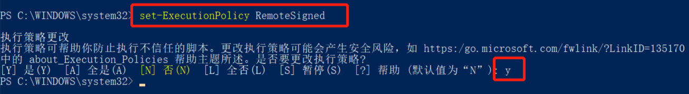
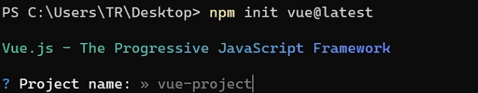
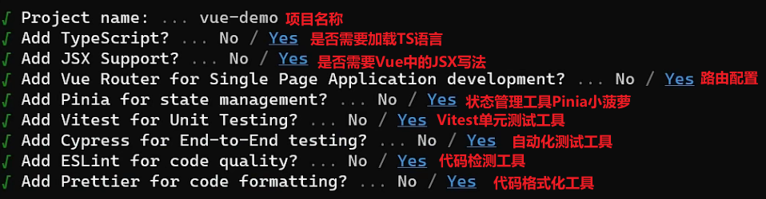
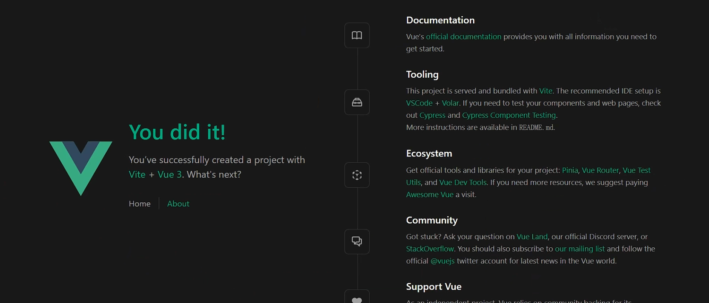
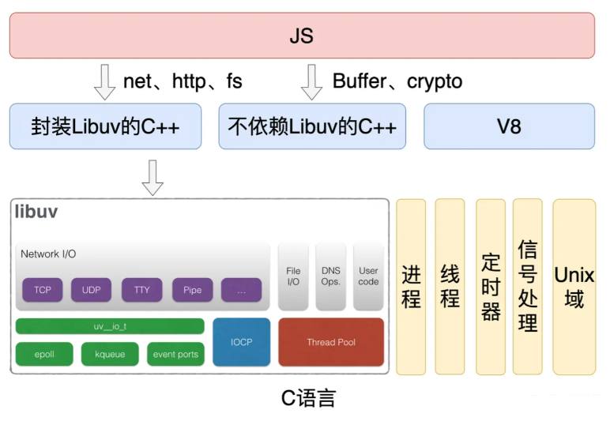
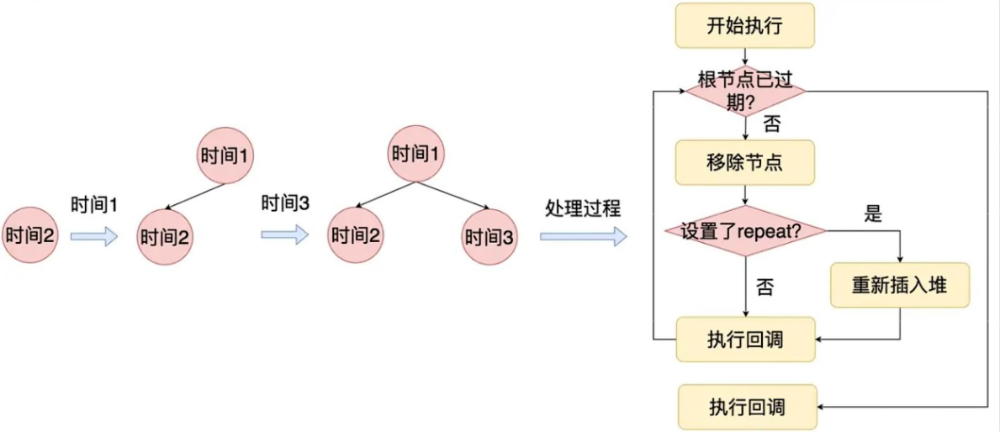

# 2_环境搭建-底层原理

:::tip 开局提示

1. 在正式开始之前，最好检查一下电脑是否拥有node环境，在终端输入node -v进行检查。没有的话去官网下载一下(下载稳定版本)：[下载 | Node.js 中文网](http://nodejs.cn/download/current/)

2. 最好的阅读方式：阅读官方文档 -- [vite官方文档](https://cn.vitejs.dev/guide/)

:::

## NVM 介绍

NVM 全称 [node](https://so.csdn.net/so/search?q=node&spm=1001.2101.3001.7020).js version management ，专门针对 node 版本进行管理的工具，通过它可以安装和切换不同版本的 node.js

`GitHub地址`:https://github.com/coreybutler/nvm-windows/releases

### Nvm 常用命令操作

|      nvm list      |   查看现在所有安装的 node 版本   |
| :----------------: | :------------------------------: |
| nvm list available |    查看 nodejs 官方的所有版本    |
|    nvm install     | （版本号）下载对应的 node 版本号 |
|      nvm use       |          切换 node 版本          |

:::tip nvm 是什么

nvm 是一个 npm 源管理器，允许你快速地在 npm 源间切换。(其实就是镜像，你可以安淘宝镜像啥的)

:::

``` title="安装NVM"
npm install -g nvm
```

1. npm ls **查看可选源 星号代表当前使用源**

2. nvm use （源）切换源

3. nvm add （名称）（源）

4. 测试速度 nvm test npm

### 替代nvm包的新一代包：xmzs

> 没错，这个xmzs就是包名，由此教程的作者小满zs编写的包。
>
> 在正式介绍这个包之前，我们来将他与nvm这个包进行一个对比：xmzs 是一个基于 Node.js 的命令行工具，它提供了与 nvm 类似的功能，可以方便地切换不同的 npm registry。虽然它和 nvm 有一些相似之处，但是两者有一些不同之处：
>
> 1. 功能不完全相同：xmzs 和 nvm 提供的功能略有不同。nvm 除了切换 registry 外，还提供了列出当前可用 registry 和测试 registry 响应时间的功能，而 xmzs 提供了批量修改 registry、查看当前 registry 等功能。
> 2. 社区支持：nvm 是一个较为流行的开源工具，它已经得到了广泛的社区支持，并且在维护更新方面也比较活跃。xmzs 相对来说较为新(因为刚写的)，目前社区支持还不如 nvm 火热。
> 3. 使用体验：xmzs 相对来说使用体验较为简单和便捷(当你安装下来的时候，会直接附带了各种镜像源能够直接切换，切换的手感也更加丝滑)，但是 nvm 在命令行交互和使用习惯方面已经比较成熟，也能够满足大多数用户的需求。

- 地址：[xmzs - npm (npmjs.com)](https://www.npmjs.com/package/xmzs)

- 使用说明：(他的命令是`mmp`，一个很社会的命令)

  1. 安装：

     ```javascript
     npm i xmzs -g
     ```

  2. ##### mmp ls 查看目前源：

     | npm       | https://registry.npmjs.org/            |
     | --------- | -------------------------------------- |
     | yarn      | https://registry.yarnpkg.com/          |
     | tencent   | https://mirrors.cloud.tencent.com/npm/ |
     | cnpm      | https://r.cnpmjs.org/                  |
     | taobao    | https://registry.npmmirror.com/        |
     | npmMirror | https://skimdb.npmjs.com/registry/     |

  3. 用法详解表格：

     | mmp命令集   | 作用                                       |
     | ----------- | ------------------------------------------ |
     | mmp use     | 切换源：选择你要切换的源                   |
     | mmp current | 查看当前源：当前源: npm                    |
     | mmp add     | 添加源：1.输入添加的地址 2.输入源地址      |
     | mmp ping    | 测试源：? 请选择镜像 cnpm 响应时长: 1635ms |
     | mmp delete  | 删除自定义源：add添加的源都可以删除        |
     | mmp rename  | 删除自定义源：add添加的源都可以删除        |
     | mmp edit    | 编辑自定义镜像地址                         |

  4. 下载动画(MMP图效)：

     > npm版本6.14.15能够看到动画，如果升级到7.1.2的npm及以上就无法看到MMP动画的显示

## 构建前端项目

### 方式1：Vite脚手架构建

```javascript title="使用vite初始化一个项目(npm、yarn)" {6}
//vite@latest 是要初始化的项目模板的名称和版本。@latest 表示要安装最新版本的 Vite
npm init vite@latest
//跟上面作用一样，任选其一
yarn create vite
//或者使用pnpm
pnpm create vite
```

2. y继续，然后给项目起个名字，这里我的名字是vite-app

3. 注意：在哪里打开终端，你的项目就建立在哪里


:::tip 安装步骤

1. 安装依赖：npm install(使用其他包管理器也行，现在的话使用pnpm install是最好的方式)
2. 依赖安装好了之后就会放到node_modules这个文件夹下
3. 启动项目：npm run dev

:::

第二天之后启动项目可能会报错，说你没有权限

我当时解决方法如下：

1. 搜索“powershell”，并“以管理员身份运行”
2. 使用命令“set-ExecutionPolicy RemoteSigned”，将计算机上的执行策略更改为 RemoteSigned




```json title="package json 命令解析" {3-5}
{
  "scripts": {
    "dev": "vite", // 启动开发服务器，别名：`vite dev`,`vite serve`
    "build": "vite build", // 为生产环境构建产物
    "preview": "vite preview" // 本地预览生产构建产物
  }
}
```

#### Vite 目录

| 文件名称   | 作用                              |
| ---------- | --------------------------------- |
| public     | 下面的不会被编译 可以存放静态资源 |
| assets     | 下面可以存放可编译的静态资源      |
| components | 下面用来存放我们的组件            |
| App.vue    | 是全局组件                        |
| main ts    | 全局的 ts 文件                    |

**index.html 非常重要的入口文件 （webpack，rollup 他们的入口文件都是 enrty input 是一个 js 文件 而 Vite 的入口文件是一个 html 文件，他刚开始不会编译这些 js 文件 只有当你用到的时候 如 script src="xxxxx.js" 会发起一个请求被 vite 拦截这时候才会解析 js 文件）**

- vite config ts 这是 vite 的配置文件具体配置项

- VsCode Vue3 插件推荐 Vue Language Features (Volar)

### 方式2：Vue CLI脚手架

::: tip 和第一种方式的区别

1. 内容相较于上面的通过vite创建的脚手架内容会更多一些，因为这是专门对Vue做出的一个定制选项

:::

```npm title="Vue CLI脚手架"
npm init vue@latest
```



- 然后会给出如下的选项：
  - 明显相对于第一个Vite创建的脚手架来说，确实是会更加全面一些
  - 后面的安装依赖，启动项目都是一样的步骤





## Node源码

::: tip node介绍

Node.js 是一个高效且轻量级的 JavaScript 运行时环境，基于 V8 JavaScript 引擎。但 Node.js 不仅仅是 V8，它还包括了许多关键的库和组件，使其成为一个强大的后端开发工具。

:::

Node.js 主要由 V8、Libuv 和第三方库组成：

1. #### Libuv 

   是 Node.js 的核心组件之一，主要负责异步 I/O。它为 Node.js 提供了事件驱动的架构，使得 I/O 操作不会阻塞主线程。Libuv 使用了如 epoll（Linux）、kqueue（BSD）、IOCP（Windows）等高效的底层 I/O 多路复用技术。

   - **1.1. 线程池：**

   尽管 JavaScript 是单线程的，但 Libuv 使用了一个线程池来处理那些无法异步执行的阻塞任务，如文件 I/O。这使得 Node.js 可以在处理大量并发 I/O 请求时仍然保持高效和响应。

2. #### 第三方库

   - #### 2.1. **cares**：

   用于异步 DNS 查询。这意味着当 Node.js 需要解析域名时，它不会阻塞主线程。

   - #### 2.2. **http_parser 和 llhttp**：

   用于解析 HTTP 请求。这些库确保 Node.js 可以快速且有效地处理大量并发的 HTTP 请求。

   - #### 2.3. **nghttp2**：

   支持 HTTP/2 协议，使得 Node.js 能够使用最新的网络通信标准。

3. #### V8引擎

   ::: tip V8引擎介绍

   V8 是 Google 开发的开源 JavaScript 引擎，也是 Chrome 浏览器的核心组件之一。它可以将 JavaScript 代码编译成机器代码，然后直接在计算机上执行，而不是解释执行，这大大提高了执行速度。

   :::

   - #### 3.1. **JIT (Just-In-Time) 编译**：

     V8 使用 JIT 技术来提高 JavaScript 代码的执行速度。这意味着 V8 在运行 JavaScript 代码之前会先编译它，使其执行更快。

     #### 3.2. **内存管理与垃圾回收**：

     V8 自带高效的内存管理和垃圾回收机制。这确保了 Node.js 应用可以高效地使用内存，同时在不再需要的对象被释放时自动回收内存。

   - 你也可以理解成**第一层**： js应用层 **第二层**： 桥C/C++ **第三层**： 底层C/C++ 



> 上面这张图是Node源码的一个架构图，其中像net、http、fs等模块就是属于应用层的内容

- libuv源码地址：[libuv/libuv: Cross-platform asynchronous I/O (github.com)](https://github.com/libuv/libuv)
- libuv官方文档在线预览：[libuv documentation](http://docs.libuv.org/en/v1.x/)
- 小满讲解的文件地址：[libuv/src/unix/core.c at v1.x · libuv/libuv (github.com)](https://github.com/libuv/libuv/blob/v1.x/src/unix/core.c)
  - 讲解的是uv_run，是事件循环的核心实现
  - 下方的图片则是通过流程图来进行形象表达



```c
/* uv_run 是 Libuv 事件循环的核心函数。
 * 它控制事件循环的执行方式和执行时机。
 */
int uv_run(uv_loop_t* loop, uv_run_mode mode) {
  int timeout;
  int r;
  int can_sleep;

  /* 检查事件循环是否有活动的事件或请求 */
  r = uv__loop_alive(loop);
  if (!r)
    uv__update_time(loop); // 更新时间

  /* 如果是默认模式并且有待处理的事件/请求，先处理定时器 */
  if (mode == UV_RUN_DEFAULT && r != 0 && loop->stop_flag == 0) {
    uv__update_time(loop);
    uv__run_timers(loop); // 执行定时器回调
  }

  /* 主事件循环 */
  while (r != 0 && loop->stop_flag == 0) {
    /* 检查是否可以进入休眠状态 */
    can_sleep = uv__queue_empty(&loop->pending_queue) &&
                uv__queue_empty(&loop->idle_handles);

    /* 执行所有待处理的请求 */
    uv__run_pending(loop);
    uv__run_idle(loop);      // 执行空闲回调
    uv__run_prepare(loop);  // 执行准备回调

    /* 计算下一个事件或超时的等待时间 */
    timeout = 0;
    if ((mode == UV_RUN_ONCE && can_sleep) || mode == UV_RUN_DEFAULT)
      timeout = uv__backend_timeout(loop);

    /* 计数器增加 */
    uv__metrics_inc_loop_count(loop);

    /* 轮询 I/O 事件 */
    uv__io_poll(loop, timeout);

    /* 处理立即回调，避免事件循环饥饿 */
    for (r = 0; r < 8 && !uv__queue_empty(&loop->pending_queue); r++)
      uv__run_pending(loop);

    /* 更新空闲时间的计量 */
    uv__metrics_update_idle_time(loop);

    uv__run_check(loop);               // 执行检查回调
    uv__run_closing_handles(loop);    // 关闭所有已标记的句柄

    uv__update_time(loop); // 更新时间
    uv__run_timers(loop);  // 再次执行定时器回调

    r = uv__loop_alive(loop);
    if (mode == UV_RUN_ONCE || mode == UV_RUN_NOWAIT)
      break;  // 若为 ONCE 或 NOWAIT 模式，则跳出循环
  }

  /* 如果 loop 的停止标志被设置，则重置它 */
  if (loop->stop_flag != 0)
    loop->stop_flag = 0;

  return r;  // 返回事件循环的状态
}
```

## 总结

- Node.js 结合了 V8 的高性能、Libuv 的异步 I/O 和众多的第三方库，使其成为一个高效、轻量级且功能强大的后端开发工具。这也解释了为什么 Node.js 在现代 web 开发、实时应用和大数据处理中如此受欢迎。