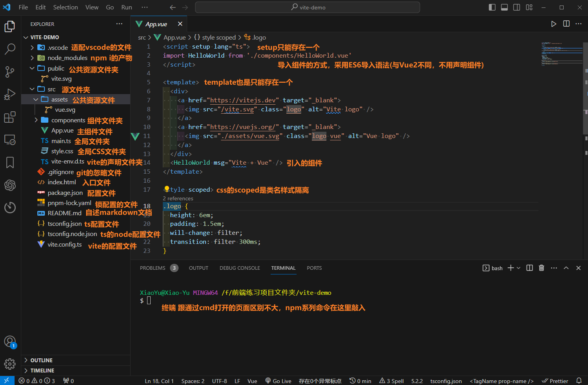
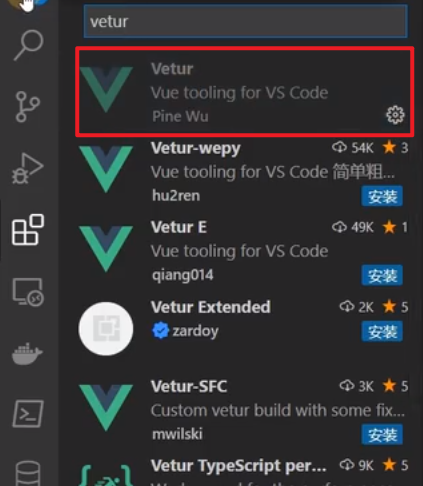
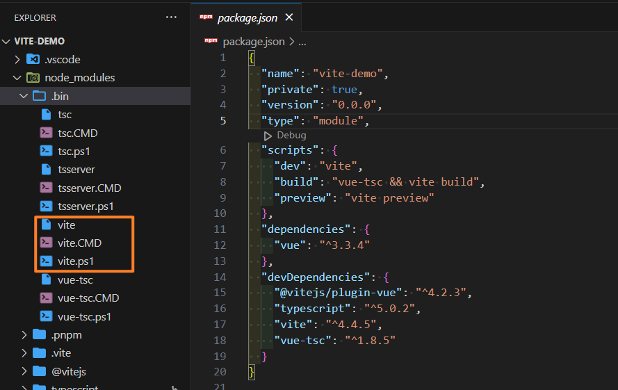

# 3_认识目录&SFC&插件

::: warning 思考

- 这份经过重构的笔记，从这里开始，我打算加入自己思考的一部分，而不是单一化的像刚开始学习那样纯跟着课程的思路，所以内容会进行拓展

:::


## Vite初始化目录文件



| Vite初始化目录文件(文件夹)     | 作用                                                         |
| ------------------------------ | ------------------------------------------------------------ |
| index.html                     | 项目的入口 HTML 文件，用于定义 HTML 结构和引入相关的资源     |
| src/                           | 源代码文件夹，通常包括项目的 JavaScript、TypeScript、CSS、图片等资源文件 |
| src/main.js                    | 项目的入口 JavaScript 或 TypeScript 文件，用于引入和初始化其他模块和组件。通俗的说就是全局文件夹，在这里的代码会全局生效 |
| public/                        | 静态资源文件夹，通常包括不需要通过模块系统引入的资源，如图片、字体等。 |
| vite.config.js、vite.config.ts | Vite 配置文件，用于定义 Vite 项目的配置选项                  |
| package.json                   | 定义项目的元数据和依赖关系的文件，通常包括项目的名称、版本、作者、依赖模块等 |
| node_modules/                  | 存放项目依赖的模块的文件夹。使用npm i后产生的文件(就是文件里面最占体积的文件夹) |
| .gitignore                     | Git 版本控制系统的配置文件，用于指定不需要纳入版本控制的文件和文件夹。避免有不想要上传代码仓库的内容一起上传上去，最典型的就说node_modules是一定会被忽略掉的，因为实在太大了 |

::: tip vite中的public文件和sec下的assets文件的区别是什么？

在 Vite 中，`public` 目录和 `src/assets` 目录都用于存放静态资源，但它们的用途和处理方式有所不同。

1. `public` 目录：
   - `public` 目录下的文件会被作为静态资源处理，不会经过 Vite 的构建处理，也不会被模块化。这些文件会直接被拷贝到最终的构建输出目录。可以通过绝对路径直接访问这些文件。例如，`public/img/logo.png` 可以通过 `/img/logo.png` 来访问。
   - `public` 目录适用于那些不需要参与构建过程的文件，比如一些大型的数据文件或者第三方库。

2. `src/assets` 目录：

   - `src/assets` 目录下的文件会被 Vite 当做模块处理，可以通过 `import` 语句在代码中引入。这些文件会经过 Vite 的构建处理，可能会被压缩、转换等。

   - `src/assets` 目录适用于那些需要参与构建过程的文件，比如图片、样式等。

> 总的来说，`public` 目录适用于不需要模块化和构建处理的静态资源，而 `src/assets` 目录适用于需要模块化和构建处理的静态资源。

:::

### App.vue

- template只能写一个

  > `template` 元素用于定义组件的 HTML 结构。因为每个 Vue 组件最终都会编译为一个 render 函数，该 render 函数会生成虚拟 DOM 树，因此 `template` 元素必须是唯一的。如果有多个 `template` 元素，Vue 将不知道应该使用哪一个作为组件的结构，因此会报错。

- setup也只能写一个(写多了报错)

  > `setup` 是 Vue 3 的 Composition API 的一部分，用于在组件内部定义 reactive state、methods 等。`setup` 函数会在组件实例创建时执行，并且只会执行一次。因此，`setup` 函数必须是唯一的。如果有多个 `setup` 函数，Vue 将不知道应该执行哪一个，因此会报错。同理可以知道不带setup的script是可以存在多个的，因为不涉及上面的这个问题

## vite插件介绍

- 一笔带过了，Vetur插件，用于Vue的智能提示的



## npm run dev全过程

- vite启动项在package里面(官网在最开始的地方也有提到)，但是不能直接在终端输入vite，因为我们没有在环境变量中配置过vite这个变量，没办法执行。

- npm run dev之所以可以是因为他使用了一种软链接的方式，从源码中可以看到当安装后vite地址会被软链接提升到.bin文件夹中。执行的时候程序就先从这里开始找的

- 这个.bin里有三个关于vite的文件

  

  | 文件名称 | 作用                           |
  | -------- | ------------------------------ |
  | vite     | linux系统                      |
  | vite.cmd | windows系统                    |
  | vite.ps1 | 跨平台的，Linux和windows都可以 |

```js title="vite"
#!/bin/sh
basedir=$(dirname "$(echo "$0" | sed -e 's,\\,/,g')")

case `uname` in
    *CYGWIN*) basedir=`cygpath -w "$basedir"`;;
esac

if [ -z "$NODE_PATH" ]; then
  export NODE_PATH="/mnt/f/前端练习项目文件夹/vite-demo/node_modules/.pnpm/vite@4.4.5/node_modules/vite/bin/node_modules:/mnt/f/前端练习项目文件夹/vite-demo/node_modules/.pnpm/vite@4.4.5/node_modules/vite/node_modules:/mnt/f/前端练习项目文件夹/vite-demo/node_modules/.pnpm/vite@4.4.5/node_modules:/mnt/f/前端练习项目文件夹/vite-demo/node_modules/.pnpm/node_modules"
else
  export NODE_PATH="/mnt/f/前端练习项目文件夹/vite-demo/node_modules/.pnpm/vite@4.4.5/node_modules/vite/bin/node_modules:/mnt/f/前端练习项目文件夹/vite-demo/node_modules/.pnpm/vite@4.4.5/node_modules/vite/node_modules:/mnt/f/前端练习项目文件夹/vite-demo/node_modules/.pnpm/vite@4.4.5/node_modules:/mnt/f/前端练习项目文件夹/vite-demo/node_modules/.pnpm/node_modules:$NODE_PATH"
fi
if [ -x "$basedir/node" ]; then
  exec "$basedir/node"  "$basedir/../vite/bin/vite.js" "$@"
else
  exec node  "$basedir/../vite/bin/vite.js" "$@"
fi
```

```js title="vite.CMD"
@SETLOCAL  :: 创建一个局部环境，这样对变量的更改不会影响到其他的命令脚本。

@IF NOT DEFINED NODE_PATH (
  :: 如果 NODE_PATH 环境变量没有被定义，设置它的值为 Vite 相关的 node_modules 路径。
  @SET "NODE_PATH=...node_modules paths..."
) ELSE (
  :: 如果 NODE_PATH 环境变量已经被定义，将 Vite 相关的 node_modules 路径添加到 NODE_PATH 环境变量的值中。
  @SET "NODE_PATH=...node_modules paths...;%NODE_PATH%"
)

@IF EXIST "%~dp0\node.exe" (
  :: 如果当前目录下存在 node.exe，使用它来执行 vite.js。
  "%~dp0\node.exe"  "%~dp0\..\vite\bin\vite.js" %*
) ELSE (
  :: 从 PATHEXT 环境变量的值中移除 .JS 扩展名。
  @SET PATHEXT=%PATHEXT:;.JS;=;%
  :: 使用 node 命令执行 vite.js。
  node  "%~dp0\..\vite\bin\vite.js" %*
)
```

```js title="vite.ps1"
#!/usr/bin/env pwsh
$basedir=Split-Path $MyInvocation.MyCommand.Definition -Parent  # 获取脚本文件所在目录的路径

$exe=""  # 执行文件的扩展名
$pathsep=":"  # 路径分隔符
$env_node_path=$env:NODE_PATH  # 保存原来的 NODE_PATH 环境变量值
$new_node_path="...node_modules paths..."  # Vite 相关的 node_modules 路径
# 如果 PowerShell 版本小于 6.0 或者是 Windows 系统，修改 $exe 和 $pathsep 的值
if ($PSVersionTable.PSVersion -lt "6.0" -or $IsWindows) {
  $exe=".exe"
  $pathsep=";"
}
# 如果 NODE_PATH 环境变量没有被设置，设置它的值为 Vite 相关的 node_modules 路径
if ([string]::IsNullOrEmpty($env_node_path)) {
  $env:NODE_PATH=$new_node_path
} else {
  # 如果 NODE_PATH 环境变量已经被设置，将 Vite 相关的 node_modules 路径添加到它的值中
  $env:NODE_PATH="$new_node_path$pathsep$env_node_path"
}

$ret=0  # 保存执行结果的状态码
# 如果当前目录下存在 node 执行文件，使用它来执行 vite.js
if (Test-Path "$basedir/node$exe") {
  # 如果脚本期望有输入，使用管道输入
  if ($MyInvocation.ExpectingInput) {
    $input | & "$basedir/node$exe"  "$basedir/../vite/bin/vite.js" $args
  } else {
    & "$basedir/node$exe"  "$basedir/../vite/bin/vite.js" $args
  }
  $ret=$LASTEXITCODE
} else {
  # 如果当前目录下不存在 node 执行文件，使用全局的 node 命令执行 vite.js
  if ($MyInvocation.ExpectingInput) {
    $input | & "node$exe"  "$basedir/../vite/bin/vite.js" $args
  } else {
    & "node$exe"  "$basedir/../vite/bin/vite.js" $args
  }
  $ret=$LASTEXITCODE
}
# 恢复原来的 NODE_PATH 环境变量值
$env:NODE_PATH=$env_node_path
# 退出脚本并返回执行结果的状态码
exit $ret
```

