# 英语语法综述

> 英语的学习需要从**语音**、**词汇**、**语法**三方面进行学习
>
> - 其中语法是最关键的部分，而词汇可以通过背诵单词进行积累，语言能让别人听懂你说什么就行，稍微不标准也没事
> - 英语语法中核心的作用：造句

### 基本句(简单句)

> ​ 当我们谈论英语语法中的基本句，我们指的是简单的句子结构，包含一个主语和一个谓语，用来表达一个完整的思想或陈述一个事实。概括起来就是**什么+怎么样**，而这个刚好对应了**两个最基本的句子成分**
>
> 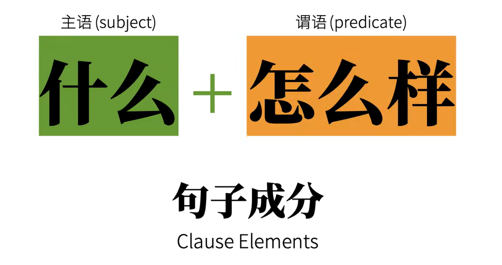
>
> - 通俗地说，一个基本句就像是一个简单的句子，它告诉我们关于某个人、物或情况的信息。这个句子通常由两个部分组成：主语和谓语。
>
> - 主语是一个名词、代词或名词短语，它是句子中的中心，表示出动作的执行者或被动接受者。它回答了句子中的“谁”或“什么”。
>
> 谓语是一个动词或动词短语，它描述或说明主语正在做的动作、状态或情况。它回答了句子中的“做什么”。

下面是一些例子来理解基本句的概念：

1. **主语 + 谓语**

   - 例句：Tom runs.（汤姆跑步。）
     - 主语：Tom（汤姆）
     - 谓语：runs（跑步）

   

   绝大多数的语句其实都是由**主语+谓语**组成的，上面图片中这个动作表达的意思是动词(Verbs)，而动作又分作哪些？

   > # 动作(动词)
   >
   > 1. ### **可以独立完成的动作**
   >
   >    主语+**不及物动词**
   >
   > ```javascript
   > Papa Rabbit sleeps
   > 兔老爹睡觉
   > //sleeps(睡觉) -- 不及物动词
   > ```
   >
   > - 这样的没有承受者的动词叫做**不及物动词**，intransitive verbs
   >
   > 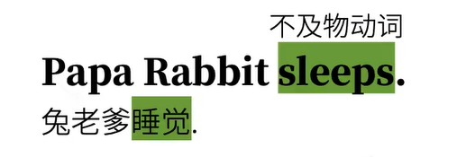
   >
   > 2. ### **有一个动作的承受者**
   >
   >    主语+及物动词+宾语
   >
   > ```javascript
   > Papa Rabbit likes you
   > 兔老爹喜欢你
   > //有了承受者 -- you(你)
   > //likes(喜欢) -- 及物动词
   > ```
   >
   > - 如果光说"兔老爹喜欢"，能够感觉到意思的不完整，因为像**喜欢**这样的动词没有承受者就没有什么实际意义
   > - 而这样的动词就属于**及物动词**，transitive verbs。这个动作的承受者就是宾语
   >
   > 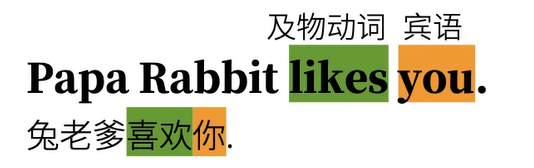
   >
   > 3. ### **有 2 个动作承受者**
   >
   >    主语+双及物动词+间接宾语+直接宾语
   >
   > ```js
   > Papa Rabbit teaches you English
   > 兔老爹教你英语
   > ```
   >
   > - 这里的核心是 teach(教)，但是教授的知识是英语，而知识的接受对象是"你"
   > - 在语法上面，我们把这样的动词的两个承受者分别称为**直接宾语(direct object)**和**间接宾语(indirect object)**
   > - 如果光说**兔老爹教英语**的话，其实语义已经完整了，因为**英语**在这里就是直接宾语了
   >
   > 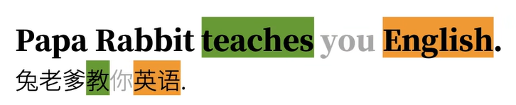
   >
   > - 而如果光说**兔老爹教你**，而又没有上下文的话，会觉得缺少了什么，所以"你"在这里是间接宾语
   >
   > 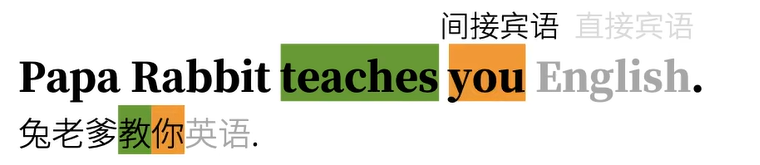
   >
   > - 这样的往往既有直接宾语又有间接宾语的动词也是及物动词的一种，更具体的说它属于**双及物动词**
   >
   > 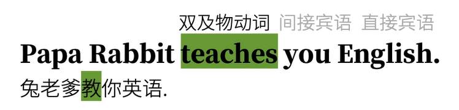
   >
   > 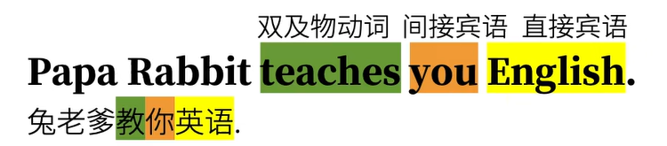
   >
   > 这时候我们对前面的第二点进行一个回顾，对于只有一个及物动词的，我们称之为单及物动词
   >
   > 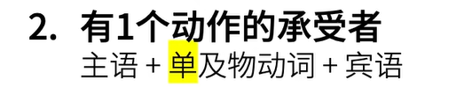
   >
   > 4. ### **只有 1 个动作承受者(但需要补充)**
   >
   >    主语+复杂及物动词+宾语+(宾语)补语
   >
   > ```js
   > Papa Rabbit considers you smart
   > 兔老爹认为你聪明
   > ```
   >
   > - 这里虽然只有一个动作承受者，也就是宾语"你"，但是如果我光说"兔老爹认为你"，很明显的会觉得这句话没有说完，认为你什么？
   >   - 但宾语"你"后面的 smart(聪明)却也不像第三种情况那样是另一个动作承受者，这样的动词必须要有一个补充承受者的信息才意义完整。而这个补充的信息，我们在语法上称之为**补足语**或者**补语**，更明确的说就是宾语补语
   >   - 这样需要补语的动词我们称之为复杂及物动词，complex-transitive Verbs
   >
   > 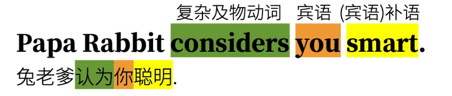
   >
   > 5. ### **非"动作"**
   >
   >    主语+系动词+(主语)补语/表语
   >
   > ```js
   > Papa Rabbit is tall
   > 兔老爹是高的
   > ```
   >
   > - 这里的 is 在日常通常都是翻译成"是"，但它实际上的作用其实很简单，就是把这个动词之后的信息赋予给前面的主语
   >   - is 这样的词为代表的一类词，作用就是把这个词后面的信息赋予给前面的词。比如在下面中兔老爹是一个主语，但是兔老爹是如何和**高的**联系在一起的？就是通过是来将高的给赋予给兔老爹，如果缺失 is 的话，就变成兔老爹高的，语句不通，缺乏将他们联系在一起的契机
   >
   > 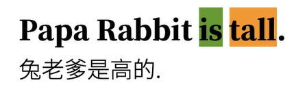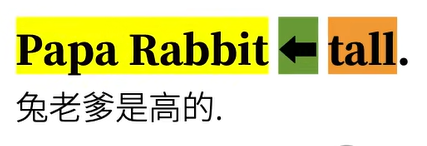
   >
   > - 如果把 tall 换成 in the room(在房间里)
   >
   > ```js
   > Papa Rabbit is in the room
   > 兔老爹在房间里
   > ```
   >
   > - 其实就是把 in the room 这个状态性质赋予给 Papa Rabbit 而已
   >
   > 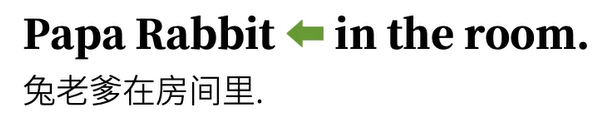
   >
   > - 同等类似的还有其他一样性质的词
   >
   > ```js
   > Papa Rabbit looks tall
   > 兔老爹看起来高
   > ```
   >
   > 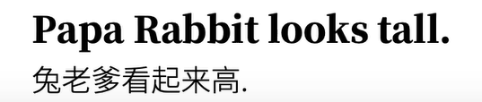
   >
   > - 其实还是一样的，把 tall(高)赋给**兔老爹**
   >
   > 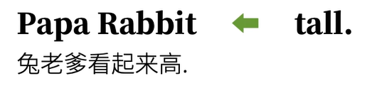
   >
   > 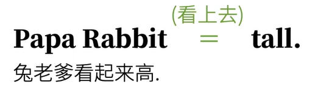
   >
   > ```js
   > Papa Rabbit smells nice
   > 兔老爹闻上去香
   > //把香跟兔老爹划上等号
   > ```
   >
   > 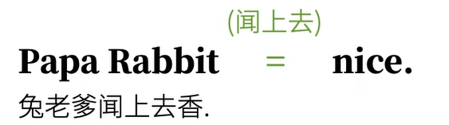
   >
   > - 像这样的赋予主语某种性质状态的"划等号"的动词，我们称之为连系动词(Linking Verbs),也就是连系起来就好的意思
   > - 连系动词也被称为"系动词"，其实就相当于缩写了一下
   > - 而系动词后的补充信息也自然是补足语、补语，更精确的说就是主语补语
   >
   > 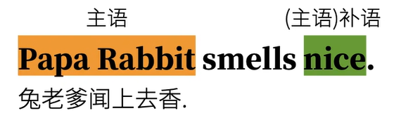
   >
   > - 而主语补语在中国的说法中，有另外一个名字，叫做表语

   ### 总结：

   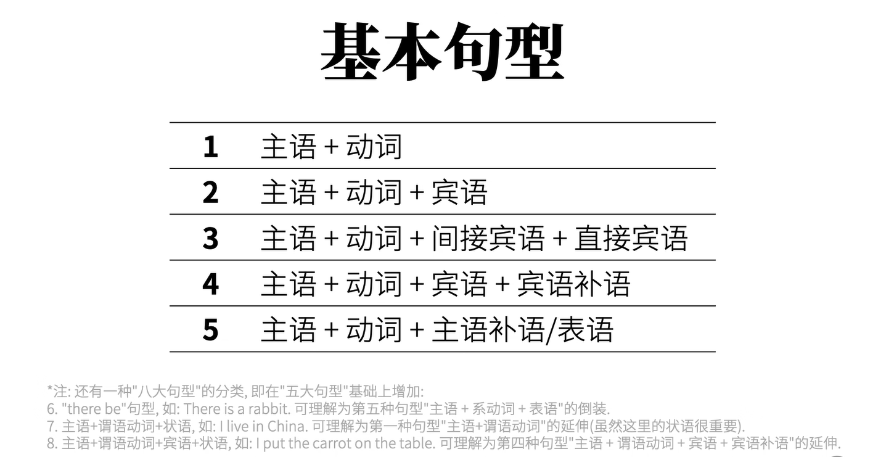

   - 这个其实就对应了我们前面写的那 5 种类型

   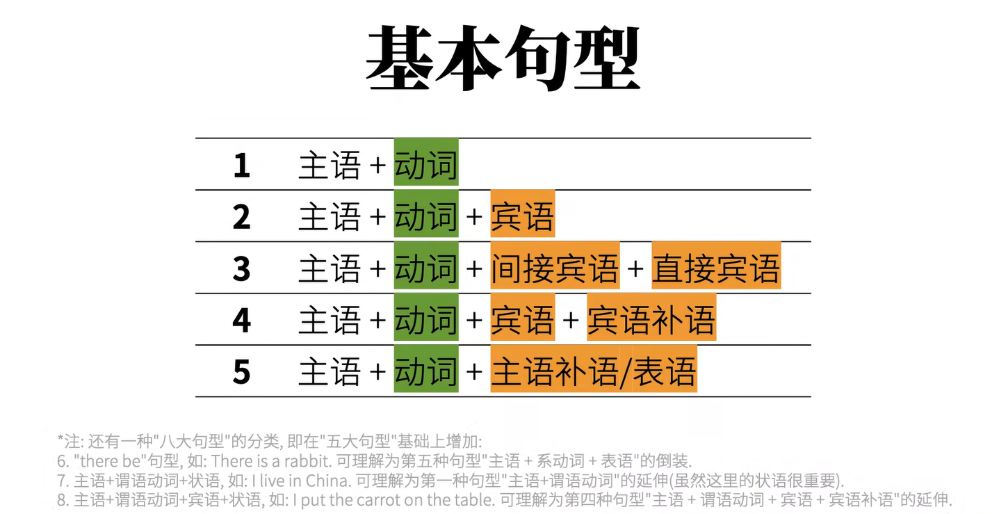

​ 然后回顾我们前面所说的，基本句其实就是**什么+怎么样**的概念，通过下方的几张图进行概括总结

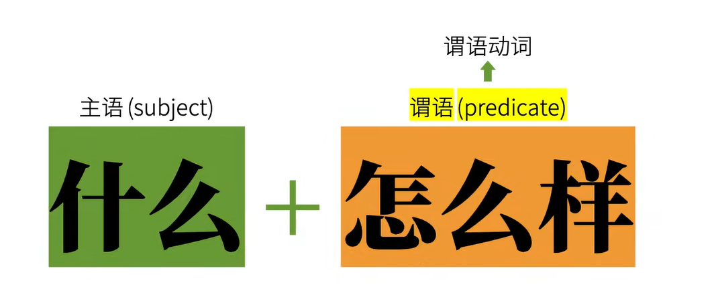

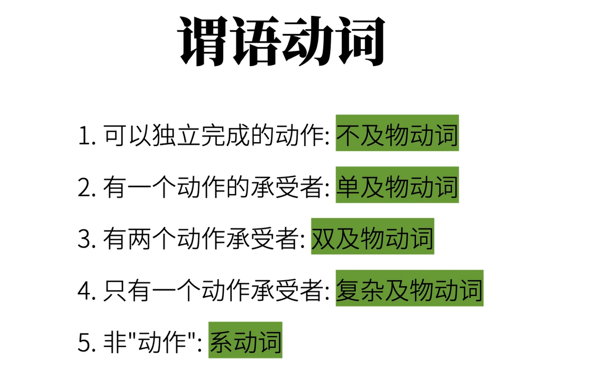


- 通常在我们脑海中，句子结构最牢不可破的就是**主谓宾**结构，而这只不过是上面中的第二个类别

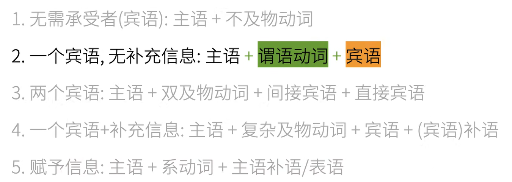

- 而严格来说，**谓语和谓语动词**是有区别的

  - 句子主语后面的余下句子就是谓语，谓语只是谓语动词的一部分。但是在平时，通俗地，为了方便，很多人会直接称呼谓语动词为谓语

    

    

  - 而把**主语+谓语动词+宾语**这样的句子结构直接称呼为主语，谓语，宾语。在平时的话其实也不是什么问题

  - 那为什么还需要提到这个呢？这是因为等下还有"非谓语动词"这个概念

### 句子成分

1. 主语
2. 谓语动词
3. 宾语
4. 宾语补语
5. 主语补语

- 上面的部分是我们刚刚所讲到的部分，而除了这些之外，还有下面这些部分：

6. **定语**

   > - 主要用来修饰主语或者宾语。
   >
   >   定语通常出现在名词的前面或后面，它可以是一个单词、一个短语或一个从句。定语的作用是限定或描述名词，使句子更具体、更具表达力。
   >
   > - 例如：
   >
   > ```js
   > The little white rabbit ate a large carrot
   > 这只小白兔吃了一根大胡萝卜
   > ```
   >
   > - the litter white(白色)就是主语 rabbit 的定语。
   >
   >   兔子，这是一只怎么样的兔子，白色的兔子
   >
   > - a large(大) 就是宾语 carrot(胡萝卜)的定语
   >
   >   胡萝卜，这是一根怎么样的胡萝卜，是一根很大的胡萝卜

7. **状语**

   > 主要用来修饰谓语动词，如：
   >
   > ```js
   > The rabbit ate quickly
   > 兔子快速地吃
   > ```
   >
   > - quickly(快速的)就是 ate 的状语

8. 同位语

   > 主要用来再把主语或者宾语说一遍，例如：
   >
   > ```js
   > Papa Rabbit，an English teacher，eats carrots
   > 兔老爹，一个英语老师，吃胡萝卜
   > ```
   >
   > - 这里的 an English teacher 其实就是把 Papa Rabbit 用不同的方式再说一遍，在这里算是和主语同等地位

上面，我们已经说到了英语句子中所有可能出现的句子成分了，但需要注意的是，我们到目前为止，上面的全是简单句，也就是拆分到不能够再拆分的类型，正常情况下我们说话写文章不全是简单句，而是各种简单句的组合在一起

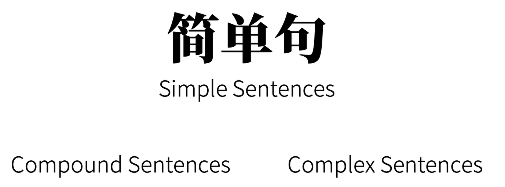

- compound sentence(复合句)说白了其实就是句子简单地叠加，是并列关系

- complex sentence(复杂句)说白了就是把一个句子套在另一个句子里，然后不断的套娃。这是一种从属关系

  - 这种一个句子 A 套另外一个句子 B 的，在英语语法上分别叫做主句(main clause)和从句(subordinate clause)。**A 是主，B 是从**
  - 在一个由主句和从句构成的复合句中，主句（main clause）是整个句子的核心部分，它**可以独立成句**，而从句（subordinate clause）则依赖于主句，**不能独立成句**。
  - 从句其实就是把简单句修改一下来充当另一个句子的句子成分

  > 主句 + 从句：
  >
  > - I will go to the park (主句) + if it stops raining (从句)。
  >   （如果雨停了，我会去公园。）
  >
  > 在这个例子中，主句是 "I will go to the park"，它是完整的句子，可以独立表达一个完整的思想。从句是 "if it stops raining"，它依赖于主句，不能单独构成一个完整的句子。从句提供了条件，描述了何时我会去公园。

  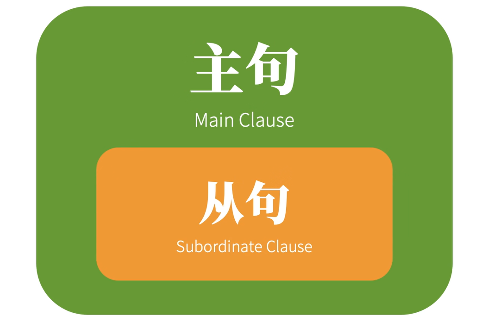

- 比如说我们修改一个简单句，它就能充当另一个句子的主语。而这就是主语从句

- 而我们修改一个简单句，充当另一个句子的宾语，这就变成了宾语从句

- 修改一个简单句，充当另一个句子的表语，就变成表语从句

- 修改一个简单句，充当另一个句子的同位语，就变成同位语从句

**以上这几种从句都具有名词的性质，所以又合称为名词性从句**

- 除了上面这 4 种之外，还有定语和状语，对应的就是定语从句和状语从句

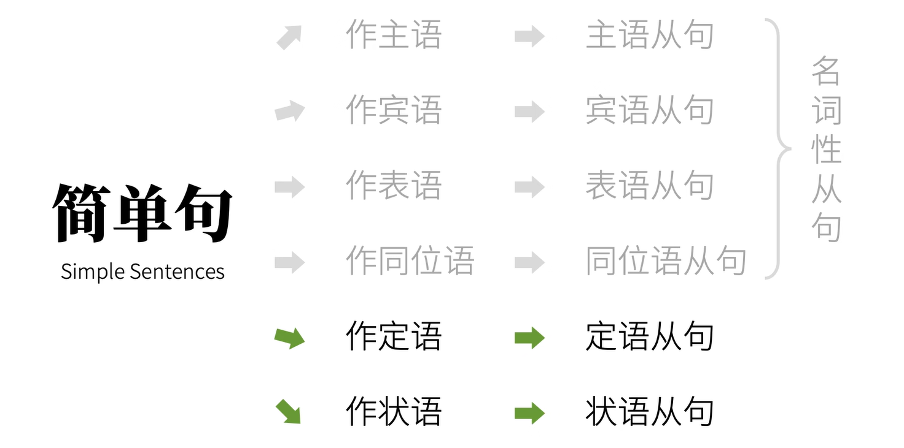

### 词性(词类)

- 两个句子也许句子组成的方式相同，比如都是主语+谓语动词+宾语

  - 但是句中包含的词的类型并不一定相同，例如下面的：

  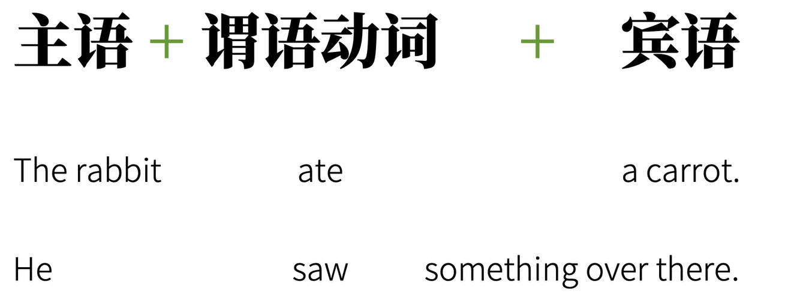

  - 同一类句子成分里有可能有不同的词类

  > - 词类，也称为词性或词的分类，是对单词根据其在句子中的语法角色和用法进行分类的方式。它用于将单词按照它们的功能和特征分组，以帮助我们理解和分析句子的结构。
  >
  > 在英语中，一般将单词分为以下常见的词类：
  >
  > 1. 名词（Noun）：用来表示人、物、地方、想法、概念等具体或抽象的实体，如 "cat"（猫）、"book"（书）、"happiness"（幸福）。
  > 2. 动词（Verb）：用来表示动作、状态或存在的词，如 "run"（跑）、"eat"（吃）、"be"（是）。
  > 3. 形容词（Adjective）：用来描述名词或代词的性质、特征或状态，如 "happy"（快乐的）、"big"（大的）、"red"（红的）。
  > 4. 副词（Adverb）：用来修饰动词、形容词、其他副词或整个句子，表示时间、地点、方式、程度等，如 "quickly"（快速地）、"very"（非常）、"here"（这里）。
  > 5. 代词（Pronoun）：用来代替名词，并在句子中扮演名词的角色，如 "he"（他）、"it"（它）、"they"（他们）。
  > 6. 介词（Preposition）：用来表示关系、位置或方向，通常与名词或代词一起使用，如 "in"（在）、"on"（在上面）、"to"（到）。
  > 7. 连词（Conjunction）：用来连接单词、短语、从句或句子，如 "and"（和）、"but"（但是）、"because"（因为）。
  > 8. 冠词（Article）：用来限定名词并指示其特定性或泛指性，有不定冠词 "a"（一个）和 "an"（一个），以及定冠词 "the"（这、那）。
  > 9. 叹词：通常以感叹号或逗号隔开，用于增强语气或表达情感。它们在语法上不与其他句子成分有直接的关联，而是作为情绪和语气的表达方式。

- 让我们进行一个简短的判断词性练习：

> 1. #### 名词（Noun）:
>
>    - 英文：The cat is sleeping.（猫在睡觉。）
>    - 中文：名词（猫）：The（冠词）、cat（名词）、is（动词）、sleeping（动词）
>
> 2. #### 动词（Verb）:
>
>    - 英文：She sings beautifully.（她唱得很美。）
>    - 中文：动词（唱）：She（代词）、sings（动词）、beautifully（副词）
>
> 3. #### 形容词（Adjective）:
>
>    - 英文：He is a tall man.（他是一个高个子的男人。）
>    - 中文：形容词（高个子的）：He（代词）、is（动词）、a（冠词）、tall（形容词）、man（名词）
>
> 4. #### 副词（Adverb）:
>
>    - 英文：They speak English fluently.（他们流利地说英语。）
>    - 中文：副词（流利地）：They（代词）、speak（动词）、English（名词）、fluently（副词）
>
> 5. #### 代词（Pronoun）:
>
>    - 英文：I love you.（我爱你。）
>    - 中文：代词（我、你）：I（代词）、love（动词）、you（代词）
>
> 6. #### 介词（Preposition）:
>
>    - 英文：She is in the park.（她在公园里。）
>    - 中文：介词（在）：She（代词）、is（动词）、in（介词）、the（冠词）、park（名词）
>
> 7. #### 连词（Conjunction）:
>
>    - 英文：I like apples and oranges.（我喜欢苹果和橙子。）
>    - 中文：连词（和）：I（代词）、like（动词）、apples（名词）、and（连词）、oranges（名词）
>
> 8. #### 冠词（Article）:
>
>    - 英文：This is an interesting book.（这是一本有趣的书。）
>    - 中文：冠词（一、这）：This（代词）、is（动词）、an（冠词）、interesting（形容词）、book（名词）
>
> 9. #### 叹词
>
>    哇（Wow）：表示惊讶、赞叹或兴奋。
>
>    - 哇，这个表演太精彩了！
>    - Wow, that performance was amazing!

- 总结的说就是英语中的十大词类
  - 且句子成分和句子中的词类是完全不同的概念。

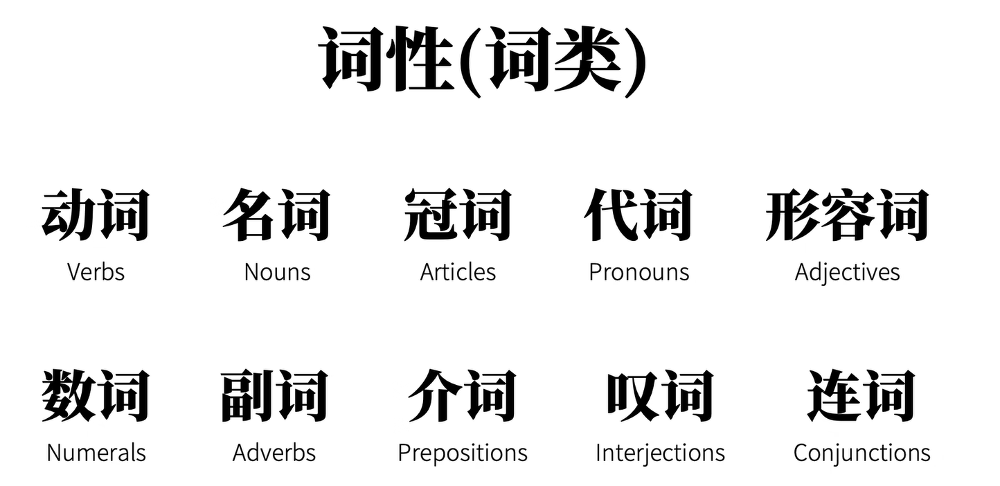

- 下面中里面的每一种句子成分，除了谓语动词是动词，其他都有可能包含不同的词类
  - 句子成分中最特殊的就是谓语动词这一类，其他句子成分可能是不同的词类，但是谓语动词，显然只能是动词


### 谓语动词的 3 大本领

1. 表示动作的**时**间

   - 动作可能在过去或将来

2. 表示动作的状**态**
   - 动作可能是已经完成的状态或者正在进行的状态

- 这两种合起来就称为时态，英语的时态就是时间+状态，而并非只有时间

**英语描述动词时间的 4 种：**

- 1.过去、2.现在、3.将来，4.从过去某个时间点"算将来"(过去未来)

**英语描述动词状态的 4 种：**

- 1.未说明(一般)、2.进行、3.完成、4.不但完成而且继续(完成进行)

> 动词的 4 种时间和 4 种状态自由排列组合，所以一共有 16 种组合结果

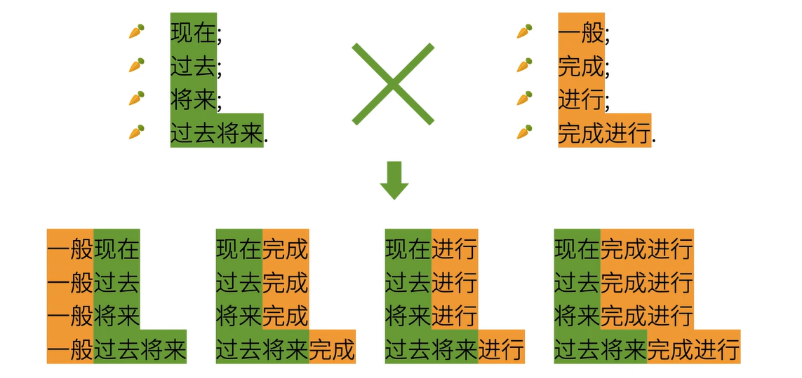

3. 动作假设、情感...

- 这个叫做动词的语气。这里的语气和平时说话的"语气"不是一个意思，而是语法的"语气"
- 比如虚拟语气，用来表示意愿，和事实相反的假设等

```js
If I were a rabbit
如果我是一只兔子
```

- I 后面的 were(而不是 was)就暗示了我不是一只兔子。**如果**一词本来就是假设的意思

​ 上面谓语的三大本领在中文中往往翻译为动词的**时、体、气**

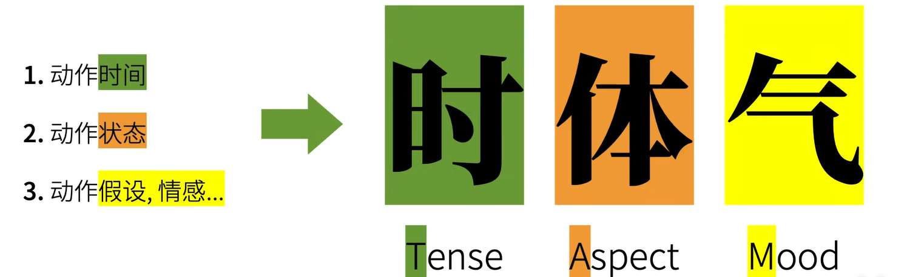

- 这里需要注意的有一点就是：英语的谓语动词本身往往时**不能够独立完成**刚刚说的这些本领的，以及另外一些其他的本领

- 而且谓语动词独自也无法完成比如表示否定、可能性、必须性等意思

- 想让谓语动词充分发挥，我们必须用到另一类经常和动词一起用的词，帮助"完成任务"

  它们就是**"助动词"(auxiliary verbs)**

> 比如 eat(吃)这个谓语动词，为了协助它表示吃过了，完成的状态
>
> 就要用到**助动词 have，也就是 have eaten**
>
> 类似的还有很多如下：
>
> 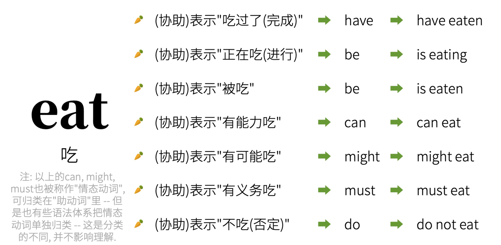
>
> - 但是有一个麻烦的事情，就是很多助动词特别喜欢伪装。它们除了做助动词(没有实际意义，只是帮助谓语动词而已)，所以不能够把助动词和它的其他身份弄混淆

- 为什么非要叫做谓语动词，而不能光叫"动词"吗？

  - 这是因为还有**"非谓语动词"**，动词除了充当句子中的谓语动词之外，还可以充当下面一系列的东西

  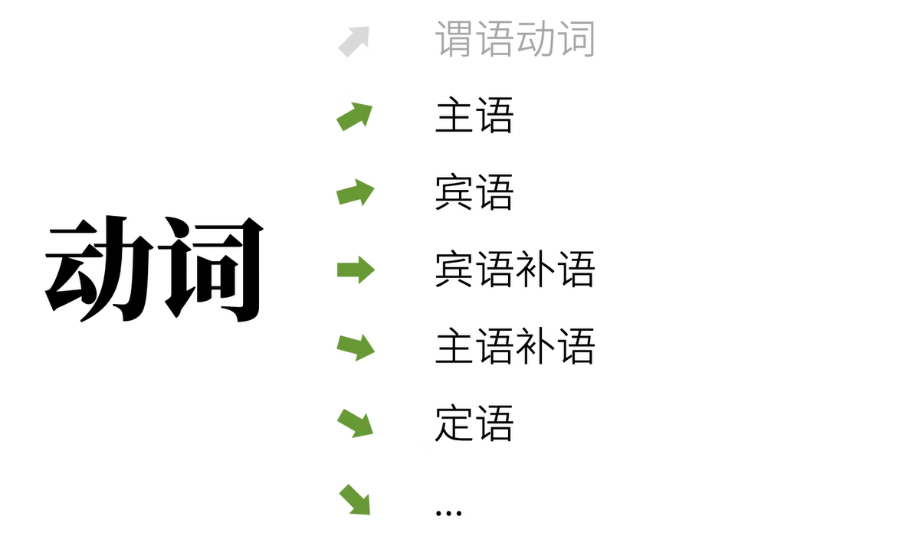

  只不过需要把谓语动词修改一下

  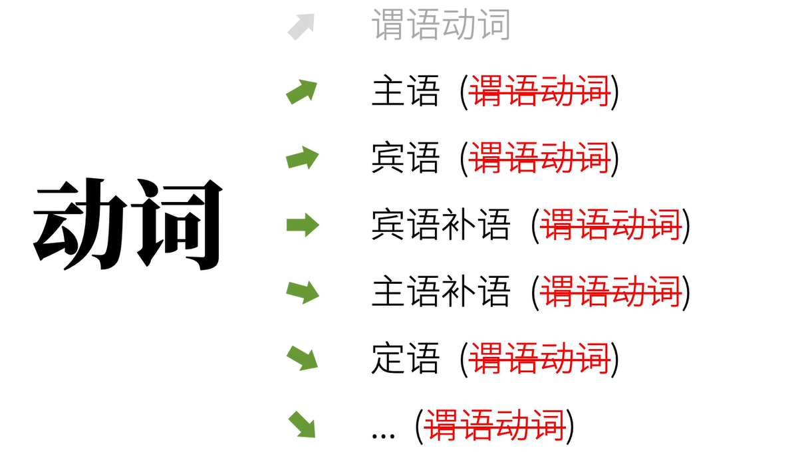

  改成非谓语动词

  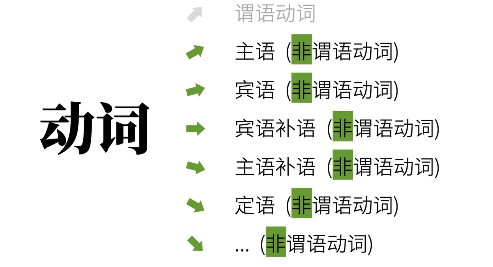

- 而且非谓语动词几乎可以取代所有的从句，从而简化句子。只不过这样的动词就不再具有表示动作时间，状态，语态，语气的功能。

- 也就是它们丧失了时态、语气、语态这些本领。它们是以不同的形式出现在句中，包括：

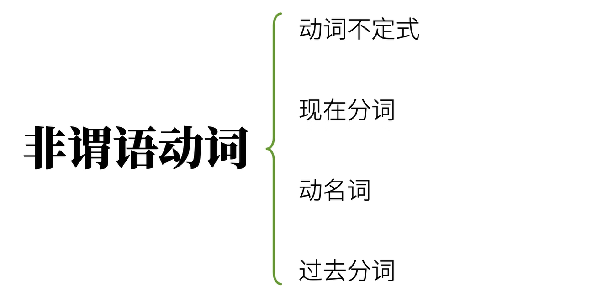

- 这里有个麻烦的地方，那就是**不定式**长得和谓语动词原形一样
  - 比如说句子中出现了 eat，我们不能确定(如果没有上下文)它时谓语动词，还是不定式，除非知道句子中其他还有什么词

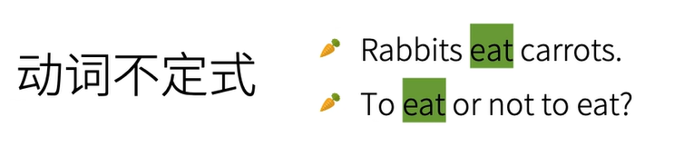

- 现在分词和动名词长得和谓语动词的进行状态一样，比如句子中出现了 eating，并不能确定(如果没有上下文)它是谓语动词进行中，还是现在分词，或者是动名词

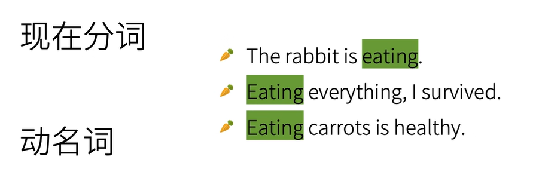

- 过去分词长得和谓语动词的完成状态一样，比如句子中出现 eaten，并不能确认它是谓语动词完成了，还是过去分词

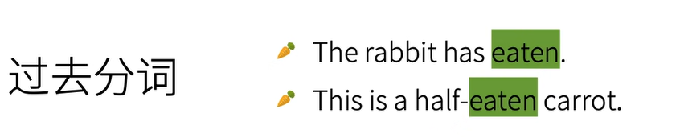

​ 所以非谓语动词也是英语语法的一大难点，上面这些概念如果不懂也没事，到目前为止，都只是一个概述而已，是让我们对英语的基本语法有一个清晰的了解，后面会详细写出每个词的意思

- 到目前为止，我们讲的一直都是动词，只是这是不同形式的动词。**英语语法的核心就是动词**
- 动词能够串联起来几乎所有语法概念，接下来我们就用动词来高度/粗略概括一下整个英语语法体系

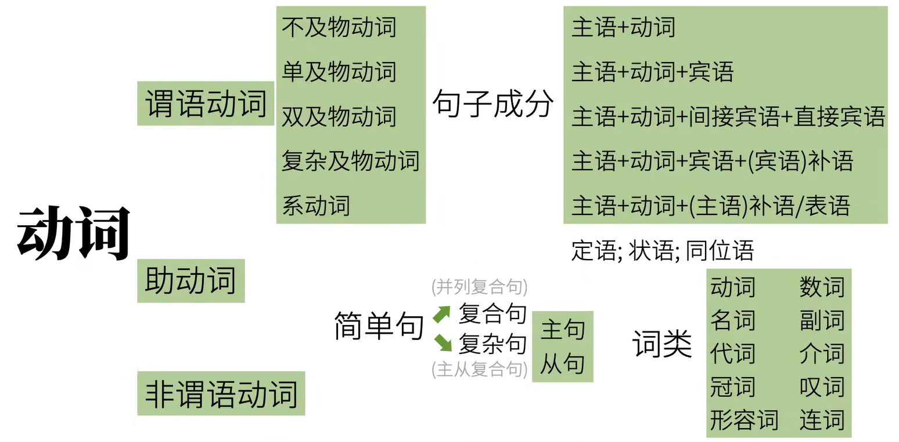

### 总结

- 绝大多数语法规则都逃不出这个框架，而无数的规则和特例也不过是让这个核心体系更加丰富而已。并且需要知道上面的框架是高度简化过的，是最核心基本的部分，代价就是牺牲了各种细节的准确性，因为针对这个框架能拓展出数不尽的内容和"特例"
