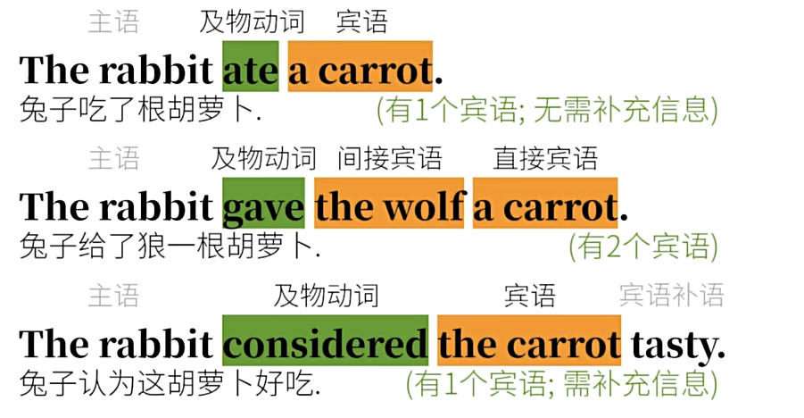
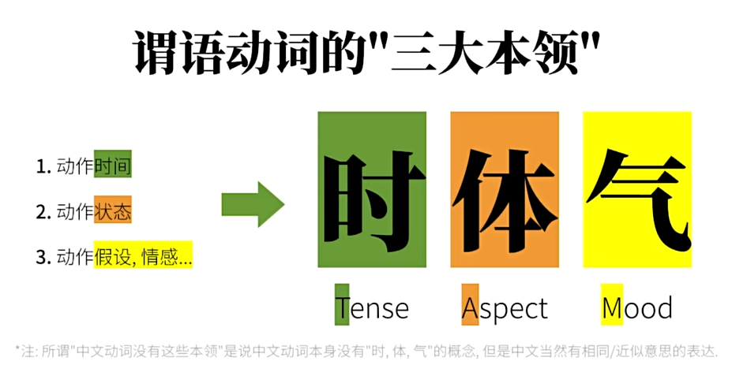

# 动词分类

在前面中- 我们说了五大类谓语动词对应了五大类句型

1. 无需承受者(宾语)的动词

   

2. 有一个宾语且无需补充信息(宾语补语)的动词

   

3. 有两个宾语：直接宾语和间接宾语

   

4. 有一个宾语且需要补充信息(宾语补语)的动词

   

5. 用来赋予状态性质的"系动词"，系动词之前是主语，之后是主语补语(又称为表语)

   

- 在传统语法中，第一类单词，即无需动作承受者的动词被称为**"不及物动词"**

- 而第二类到第四类需要动作承受者的动词被称为**"及物动词"**

- "及物"的"及"是"到达、关联、带着"的意思，所以"及物"的意思就是"要带个人物品/人物"的意思，也就是说动作是有对象的，而这个对象就是动词的宾语

### 实义动词

- **及物动词和不及物动词合起来就是"实义动词"(**也叫做行为动词)
  - 至于为什么这么叫，是因为这些动词通常都是具有实际意义的
- "及物"和"不及物"是实义动词按照"动作承受者"来分类的
- 如果按照"状态动作"来分的话，实义动词还可以分为"动作动词"和"状态动词"
  - **动作动词：**例如eat(吃)，明显是一个需要"动起来"的动作
  - **状态动词：**但是像have(有)、feel(感觉)、own(拥有)、believe(相信)这样的"动作"并没有真的"动起来"，这就是所谓的状态动词，相对静止

- 说到这里，我们已经包括了不及物动词、及物动词(单、双、复杂)，只剩下第五类的系动词(连系动词)
  - 传统的语法往往是把它单独另作一类，可能是认为系动词的"实际意义"不强，往往只是"连系"主语和主语补语(表语)
  - 但其实也有些语法体系是把系动词算作"不及物动词"里面的，而系动词往往也被视为"状态动词"
  - 实义动词和系动词可以做句子的谓语动词

### 助动词和情态动词

- 另外还有"助动词"和"情态动词" -- 它们是不能独立作谓语动词的，而往往"情态动词"往往也被视为"助动词"的一种

### 非谓语动词

- 除了谓语动词之外，还有非谓语动词，也叫做"非限定性动词"，一个简单句只能有一个谓语动词，可以表达**谓语动词中的三大本领"时、体、气"**

- 而句中其他的动词必须以非谓语动词的身份出现，无法表达"时、体、气"，这些内容会在后面的**非谓语动词**主题中提到

### 总结

- 其实，动词分类的名堂很多，术语也很多
  - 比如有时候会听到"完全及物动词"和"不完全及物动词"这样的术语，其实就是在说"是否需要宾语补语"
  - 而需要宾语补语的词还可以细分为"认定动词"、"任命动词"、"使役动词"等等

- 语法体系有很多种，随着时间的推移，同一个语法体系也会改变，所以某一类词到底怎么归类，不是一个精确的科学。作为学习中者是不需要去较真哪个词到底应该划分到哪一类