# 动词时态

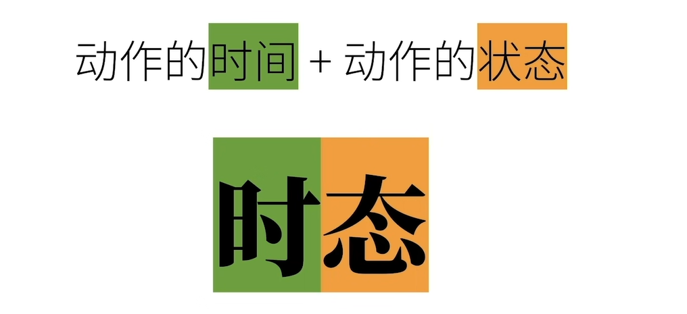

- 时间(4 种)× 状态(4 种)，一共 16 种组合
  - 这里说的是国内传统的英语教学的语法体系，而语法体系在国内国外其实都有不少版本，也有很多不同的争论

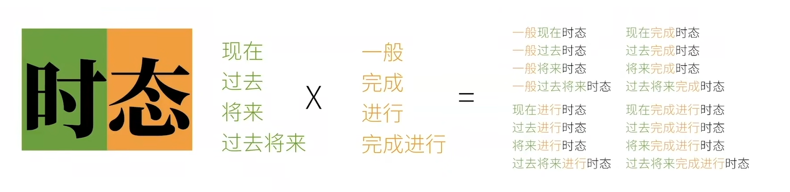

- 有的人主张动词的时间和动词的状态(动词的"体")完全独立
- 有的人则认为英语其实根本没有将来时态。因为动词并没有将来式变位

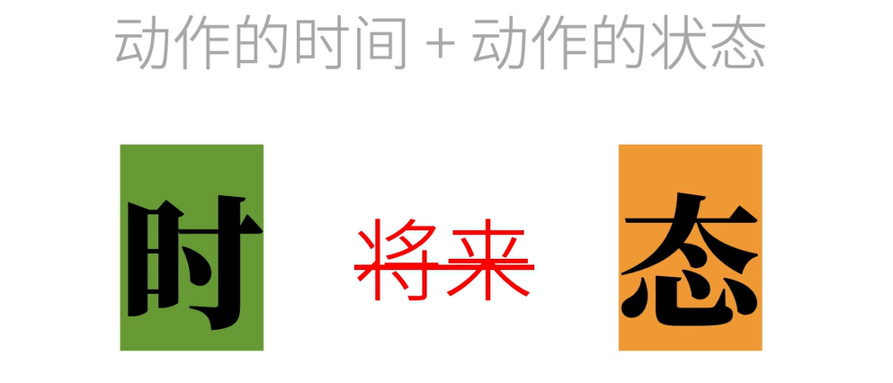

- 有的人认为 16 种时态并不正确，实际上没有这么多，甚至有的语法体系中直接忽略其中的几种


> 本笔记中，以国内的语法体系为主，下面该动词时态的主题中主要的核心是**所有的动词时间以及所有的动词状态**
>
> - 优先弄懂时间和状态的概念，然后再具体讨论用上面词去具体构成时态

### 动词时间

- 英语动词的四种时间：

  - 前三种：现在、过去、将来

  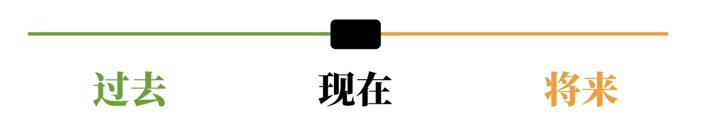

  - 第四种：**过去将来**

    这是什么意思？就是对于过去某一个时间点而言的将来

    1. 例如：昨天是前天的将来

    2. 但是过去的将来和现在的关系就不一定了。

       比如昨天的后天是明天，是现在的将来。也就是说**"过去将来"和"现在"没有必然的连系**

- 我们可以暂时默认过去的将来在现在的过去

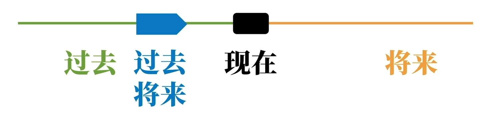

- 但这不是一定的事情，正如前面所说的没有必然的联系。

  - 这听上去其实挺扯淡的，但其实这个**过去将来**时间在现实中也不常见的

    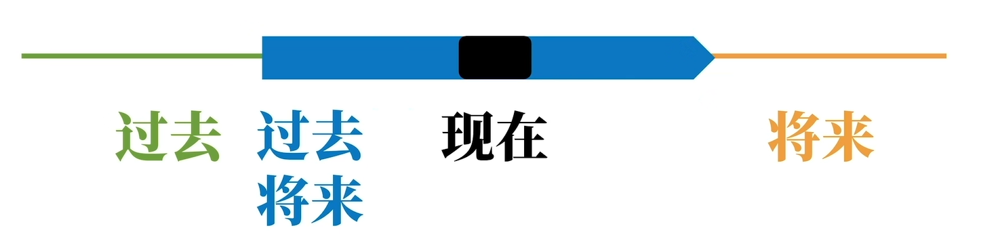

  - 一般只出现在从句中

    

  - 而像**"过去将来完成进行时态"**这样的，听上去很见鬼

    - 之所以要说，是因为英语动词有能力构成这种时态，所以需要列举出来。而有些语法体系甚至也不把它算作时态

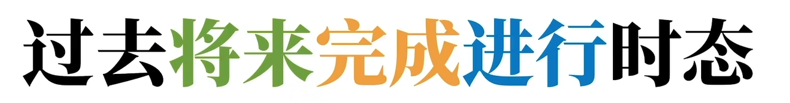

### 动词状态

先拿中文举例：

- **进行状态**：这兔子正在吃着胡萝卜

  兔子这个吃胡萝卜的动作或者说过程正在进行中

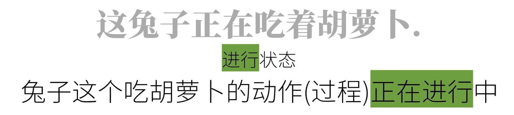

- **完成状态**：这兔子吃掉了胡萝卜

  言下之意就是：胡萝卜以及在兔子的肚子里了，兔子吃完吃饱了，多半不再继续吃了

  注意：**完成态的重点在动作状态完成了，而并没有指出动作具体发生的时间**，所以不管在哪种时间里，完成状态并不直接说明动作的具体开始时间

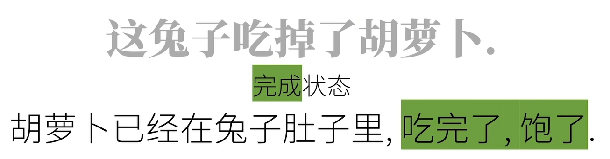

- **完成进行状态**：这兔子从早上就开始吃胡萝卜，到现在还没有停呢
  - 这个表示动作的一部分完成了，但剩下的还在进行中

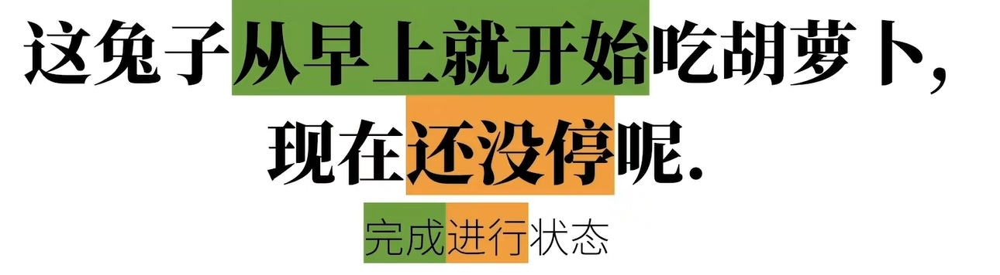

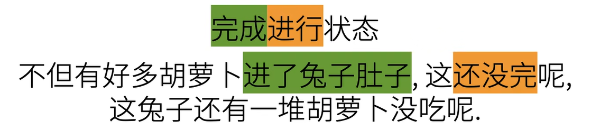

- 默认的，简单的，**一般**的状态

  - 这个"一般"状态在没有时间的帮助下，可能有那么一点难描述，所以我们结合时间来描述
  - 这兔子过去吃胡萝卜，将来也吃胡萝卜
  - 前半句是过去时间、后半句是将来时间。但这个动作的状态是什么呢？**吃**是我们的动作，但是这个时候处于什么状态？过去吃，那是已经吃完的，那是完成时吗。未来也吃，那是还没吃到的，但动作也没有所谓的"不完成"状态
  - 所以说如果我们把时间的信息去掉，其实句子中并没有特别指出动作的状态。即使是过去动作"已经完成"这一信息也是推导出来的，句子本身并没有这么说。甚至可以说，似乎"没有状态信息"，这样的状态就是所谓"一般状态"

  

- 从上面这些例子中，我们可以看出，英语动词的时间和状态，往往是联系得非常紧密的。这里我们之所以拆开，是为了方便学习，如果去和将英语作为母语的人讨论时间+状态，别人可能听不懂，然后回答你说就怎么顺口怎么自然就怎么说

### 时间+状态

> 先通过中文理清概念

#### 现在时态(4 种)

- 如果以**"现在"**为基准，那么"现在"的动作就有以下四种状态
- **现在进行时态**：现在这兔子正在吃胡萝卜

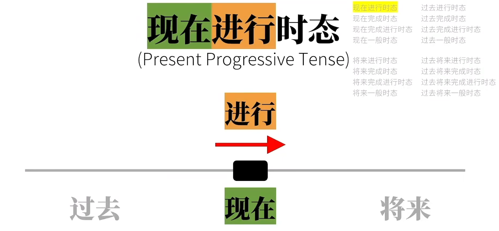

- **现在完成时态**：这兔子已经吃完了胡萝卜

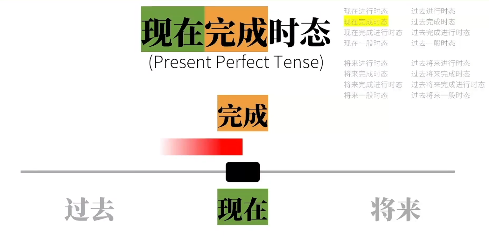

- **现在完成进行时态**：这兔子已经吃完了一些胡萝卜，还要继续吃。具体还要吃多久，那就不清楚了

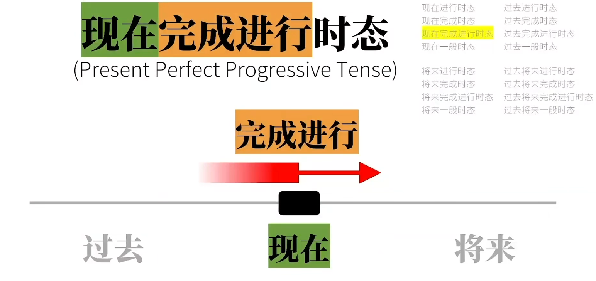

- **现在一般时态**：对现在而言，没有特别指出的状态。例如：兔子吃胡萝卜

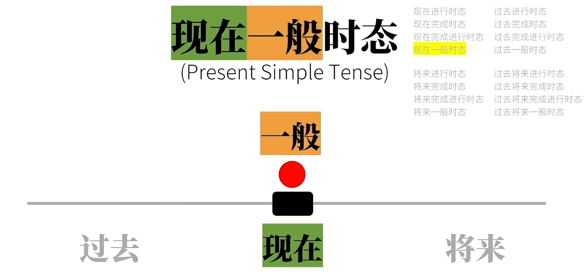

#### 过去时态(4 种)

- 如果把以上四种情况往前推一个时间段，去到过去。
  - 也就是过去的四种时态
- **过去进行时态**：这个兔子昨天下午三点正在吃胡萝卜

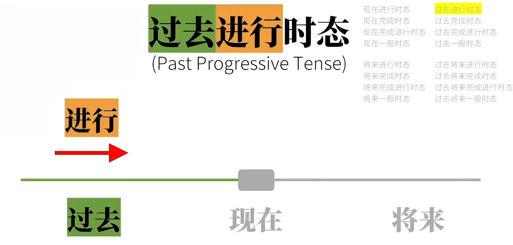

- **过去完成时态**：这兔子昨天下年 3 点那个时候已经吃完了胡萝卜

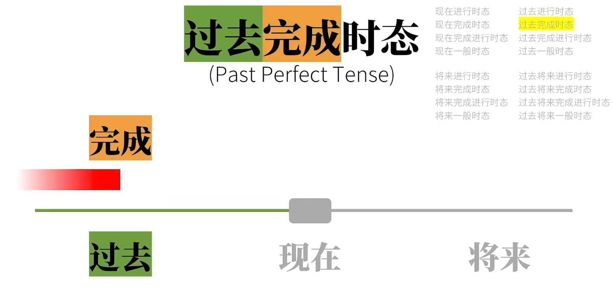

- **过去完成进行时态**：这兔子昨天下午 3 点那个时候已经吃完了一些胡萝卜，还要继续吃

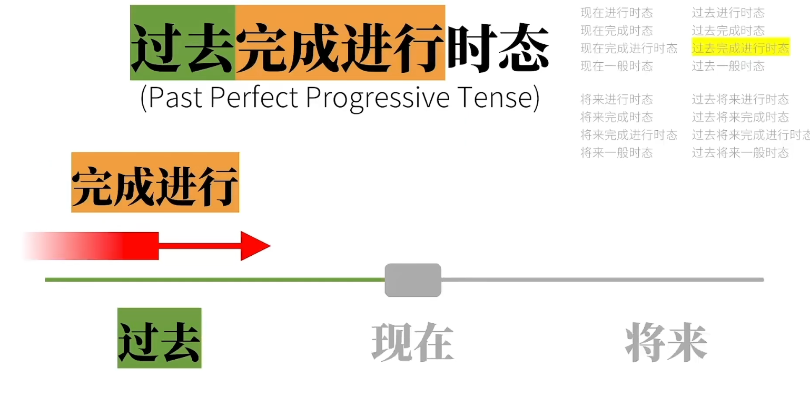

- 对过去而言，没有特别指出的状态。
  - **过去一般时态**：例如：兔子过去吃了胡萝卜

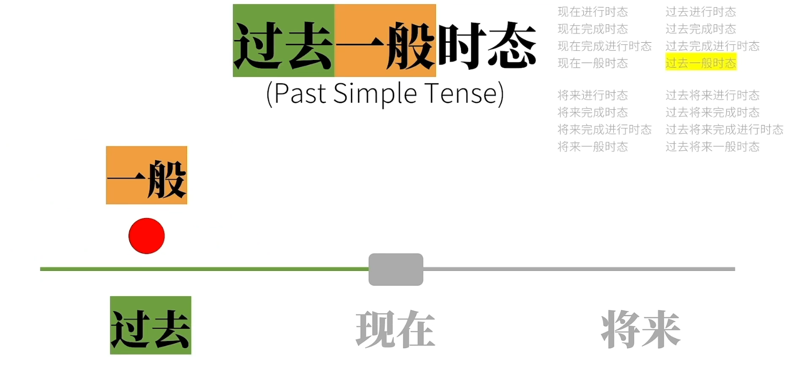

#### 将来时态(4 种)

- **将来进行时态**：这个兔子明天下午 3 点那个时候会在吃胡萝卜


- **将来完成时态**：这兔子明天下午 3 点那个时候会已经吃完了胡萝卜
  - 之前什么时候开始吃？不知道，也可能现在已经开始吃了，总之明天 3 点那个时候，肯定吃完了

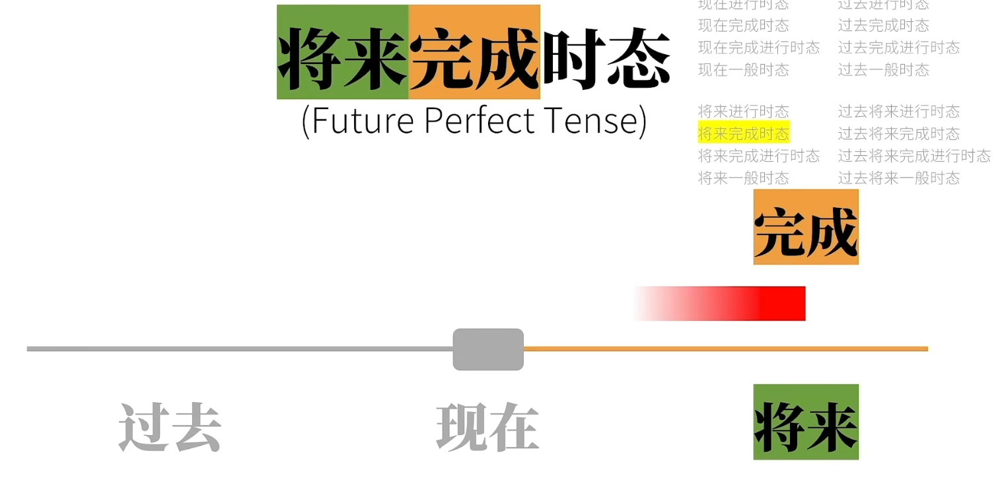

- **将来完成进行时态：**这兔子明天下午 3 点那个时候，已经吃完了一些胡萝卜，还要继续吃
  - 什么时候开始吃，什么时候结束吃。我们都不知道，总之明天 3 带你那个时候已经吃了一段时间，而且还不停止

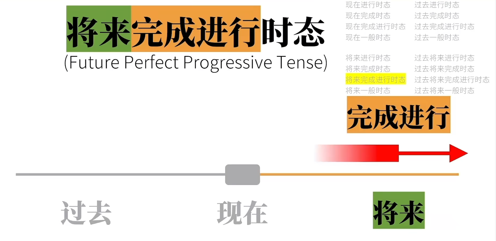

- **一般将来时态：**兔子将来吃胡萝卜
  - 只是单纯表示这动作会发生在将来而已


#### 过去将来时态(4 种)

> 有点抽象，有些语法书甚至不收录

- **过去将来进行时态：**

  - 过去将来进行时态用于描述在过去某一时间点之前，某个动作预计正在进行或即将进行

  > 过去将来进行时态是英语中的一个特定时态，表示在过去某一特定时间点之前，某个动作正在进行或将要进行。它的结构是：**主语 + would be + 动词的现在分词**。
  >
  > 让我们通过一个例子来详细解释。
  >
  > 案例： 假设现在是星期五，你的朋友在星期三告诉你，他们计划在星期四去公园。现在你正在描述他们星期三时的话，你可以这样说：
  >
  > "On Wednesday, they said they **would be going** to the park on Thursday."
  >
  > 在这个例子中：
  >
  > - "On Wednesday" 是我们谈论的过去的时间点。
  > - "they said" 是一个表示过去的动作。
  > - "they would be going to the park on Thursday" 使用了过去将来进行时态来描述在星期三时，他们计划星期四正在进行的活动。
  >
  > 在这种时态中，“would be”表示这是一个将来的动作，但因为我们是在描述过去的时候说的，所以使用了“would”。而“going”（动词的现在分词形式）表示这是一个正在进行的动作。

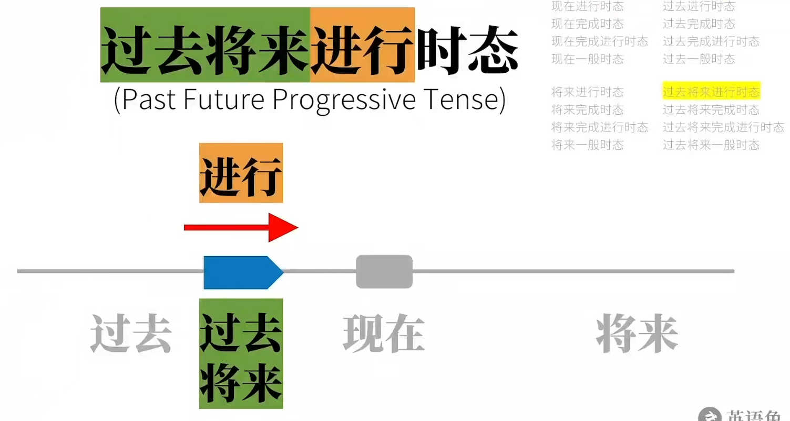

- **过去将来完成时态：**

  - 过去将来完成时态用于描述一个预期在某个过去的时间点之前已经完成的动作。

    其结构为：**主语 + would have + 动词的过去分词**。

  > - 这种时态通常用于描述在另一个过去的动作或时间点之前预计已经发生的事情。它通常与过去的时间状语连用，例如“by the time”。
  >
  > 假设你和朋友在星期五聊天，你想告诉他，如果你在星期四早上买了彩票，到星期四下午你就可能中奖了。你可以这样描述：
  >
  > ### 案例：
  >
  > "By Thursday afternoon, I **would have won** the lottery if I had bought a ticket in the morning."
  >
  > 在这个例子中：
  >
  > - "By Thursday afternoon" 是我们谈论的过去的时间点。
  > - "I would have won" 使用了过去将来完成时态来描述一个假设的情况：如果你在星期四早上买了彩票，那么到星期四下午你可能已经赢了。
  > - “if I had bought a ticket in the morning” 是一个条件句，描述了一个假设的过去动作。
  >
  > 总的来说，过去将来完成时态用于描述一个预期在某个过去的时间点之前已经完成的动作。

**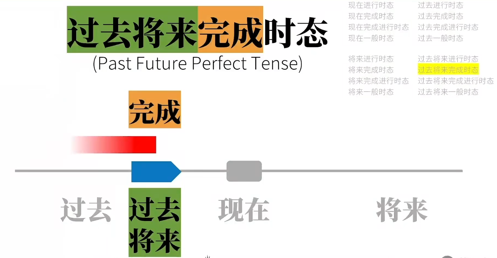**

- **过去将来完成进行时态：**

  - 过去将来完成进行时态是一个相对复杂的时态，它描述了一个预期在某个过去的时间点之前已经开始，并且可能持续进行或已经结束的动作。

    其结构为：**主语 + would have been + 动词的现在分词**。

    解释： 这种时态用于描述在过去某个特定时间或动作之前，某事已经开始并可能仍在进行的预期或假设情景。

  > 案例： 想象一下，现在是星期五，你原计划从星期一开始每天跑步，持续到星期五。但由于某种原因，你星期一并没有开始跑步。现在，你在描述如果星期一你开始了这个计划，到星期四你会持续跑步已经四天。你可以这样说：
  >
  > "By Thursday, I **would have been running** every day for four days if I had started on Monday."
  >
  > 在这个例子中：
  >
  > - "By Thursday" 是我们谈论的过去的时间点。
  > - "I would have been running" 使用了过去将来完成进行时态来描述一个假设的情景：如果你从星期一开始，那么到星期四你已经连续跑步四天了。
  > - “if I had started on Monday” 是一个条件句，描述了一个假设的过去动作。
  >
  > 简言之，过去将来完成进行时态用于描述一个预期在某个过去的时间点之前已经开始并可能持续进行或已经结束的动作。

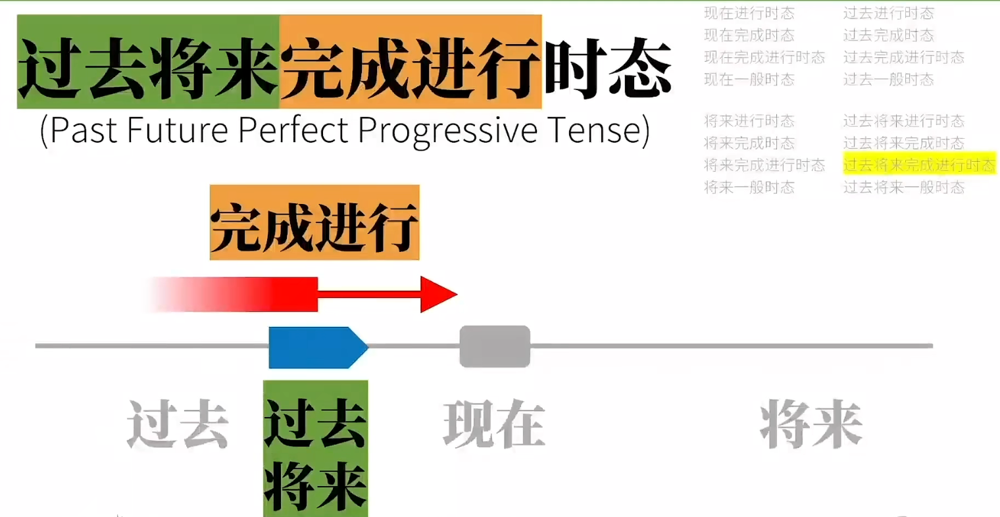

- **一般过去将来时态：**

  - 一般过去将来时态用于描述在过去某个时间点或动作之后预计会发生但还没有发生的动作或事件。

  - 其结构为：**主语 + would (或 should, 对第一人称) + 动词的原形**。

    解释： 这种时态通常用于描述在另一个过去的动作或时间点之后预计会发生的事情。它经常用在间接引语中，表示过去说过的关于将来的事情。

  > 案例： 想象一下，上个星期你的朋友告诉你，他计划这个星期去海边度假。现在，你想告诉另一个朋友你之前听到的计划，你可以这样说：
  >
  > "Last week, he told me he **would go** to the beach this week."
  >
  > 在这个例子中：
  >
  > - "Last week" 是我们谈论的过去的时间点。
  > - "he told me" 是描述过去动作的部分。
  > - "he would go to the beach this week" 使用了一般过去将来时态来描述你的朋友上周告诉你的关于这周的计划。
  >
  > 总之，一般过去将来时态用于描述在过去某个时间点或动作之后预计会发生但还没有发生的动作或事件。

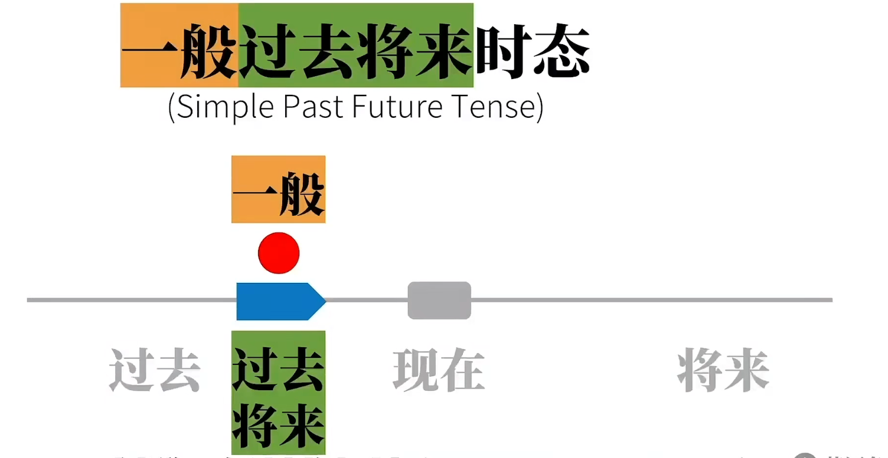

这样，我们就完成了前面 16 种时态的概括。

- 在详细讲解 16 种时态之前，我们先说英语时态中最需要注意或者说最容易犯错的地方：

### 时态四大难点

#### 时态分不清

- 难点 1：**时** & **态** 分不清
  - 学校里教时间和状态往往是"揉"在一起教的，或者即时区分，往往也不特别指出。这就导致，很多人脑海中的时态 16 种就是混乱在一起的

#### 动词变位

- 难点 2：动词**变位**

  - 英语动词往往有"变位"现象，也就是单词拼写往往会改变，英语时态的各种"时态"和"状态"的概念

  - 在中文中也可以表达相同的概念。问题在于，中文里表达时间的概念，只需要加上描述时间的字眼就行了，不需要对字本身做出改动，汉字的写法在不同时间状态里不会改变

    例如：**吃 => 吃了**

    

  - 但在英语中就不同了，表达不同的时态，不但往往要加上表示时间的信息，还往往会对动词本身的拼写做出该动

  - 比如下方中的动词原形**eat**就要改拼写为**ate**，这个就是动词的时态变位

  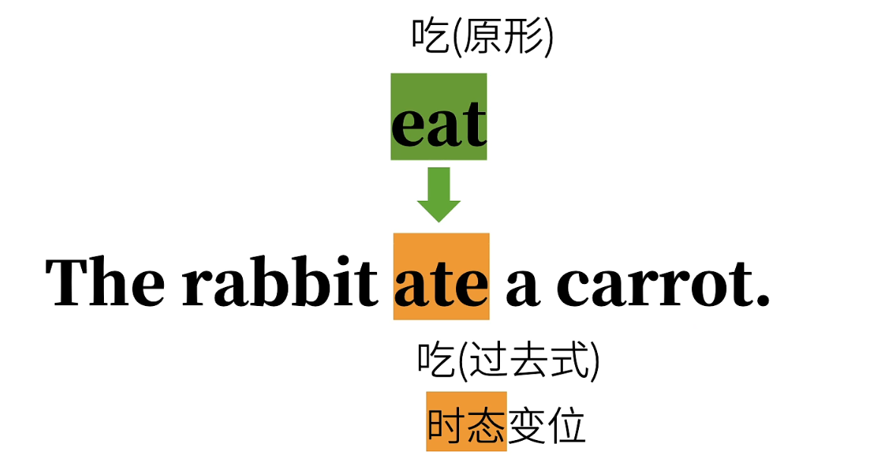

  - 即使在同一个时间，如现在的时间里，第三人称要加 s，这个属于动词的"人称变位"
  - 再比如 am、is、are 是动词 be 的现在时间里的人称变位
  - was，were 是 be 再过去时间里的人称变位

  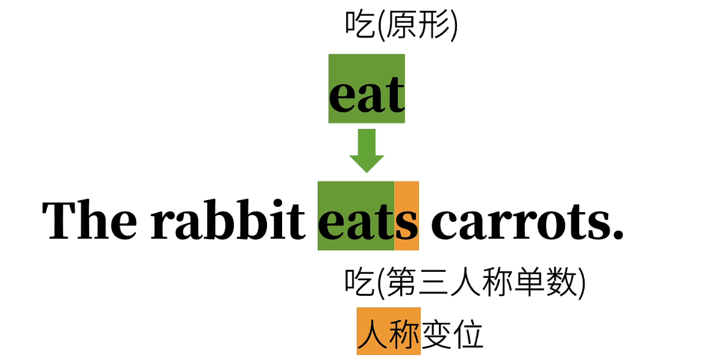

#### 助动词

- 难点 3：助动词

  - 英语时态往往需要借助另一种动词，也就是助动词。而助动词不但有的时候出现，有的时候不出现。
  - 而且往往和之后的实义动词一样，也要进行"动词变位"，所以又是"难上加难"
  - 比如下面的进行状态：

  这三句里都有助动词 be 的身影，但因为**动词变位(be 变成 was，been)**，看上去却不一样了，这会让我们学得更加的混乱

  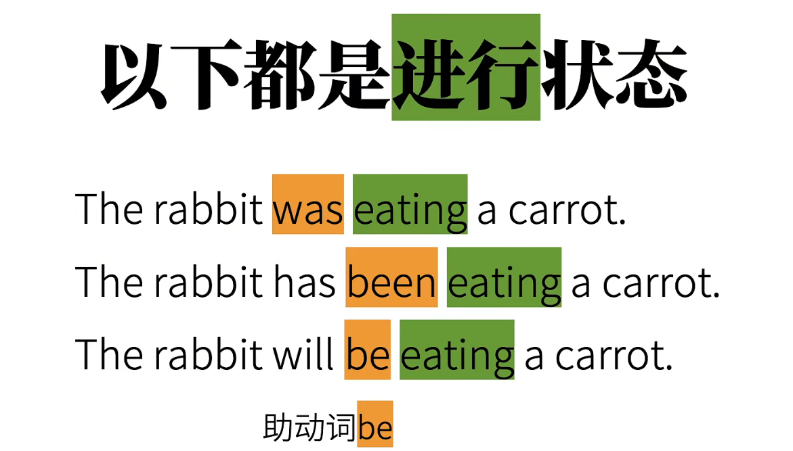

#### 与其他语法概念混合

- 难点 4：与其他语法概念混合
  - 时态往往和其他语法概念和现象混在一起

> 例子：
>
> - 现在完成时态的 The rabbit has eaten the carrot(这兔子吃掉了这胡萝卜)可以和**情态动词 may**使用
>
> 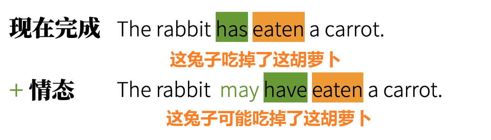
>
> - 如果再来个情态动词也加上时间再加否定。或者改为被动
>
> 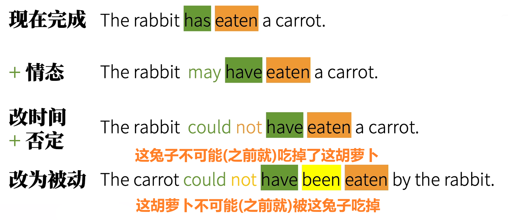
>
> - 为了孤立时态的难点，暂不讨论助动词中的情态动词这一类，也不讨论被动态等其他语法概念

### 16 种时态构成

#### 一般现在时态

- 构成较为简单：直接加动词原形，也就是动词在字典里的词条就行

> 动词原形（Base Form）是动词的最基本形式，没有任何时态、人称或数的变化。它是查找词典时通常用到的形式，并且是构建其他动词形式的基础。
>
> - 例如，以下是一些动词原形及其相关的变形：
>
> - **run**
>   - runs (第三人称单数现在时)
>   - running (现在分词)
>   - ran (过去式)
>   - run (过去分词，这个动词的过去分词与其原形相同)
> - **eat**
>   - eats (第三人称单数现在时)
>   - eating (现在分词)
>   - ate (过去式)
>   - eaten (过去分词)
>
> 在英语语法中，动词原形有以下用途：
>
> 1. 构成简单现在时（除了第三人称单数外）。
>    - I **run** every morning.
>    - They **eat** breakfast at 7 AM.
> 2. 构成命令句。
>    - **Open** the door.
>    - **Sit** down.
> 3. 与模态动词（如 can, will, should, might）一起使用。
>    - She **can speak** three languages.
>    - You **should go** to the doctor.

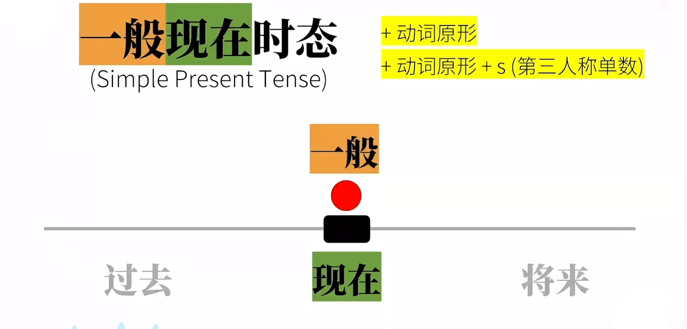

- 除了第三人称单数要在词尾加 s，比如下面这些，这个时态可以说是最"容易构成"的时态，但这个**"一般"态**反而是最容易出错的时态之一

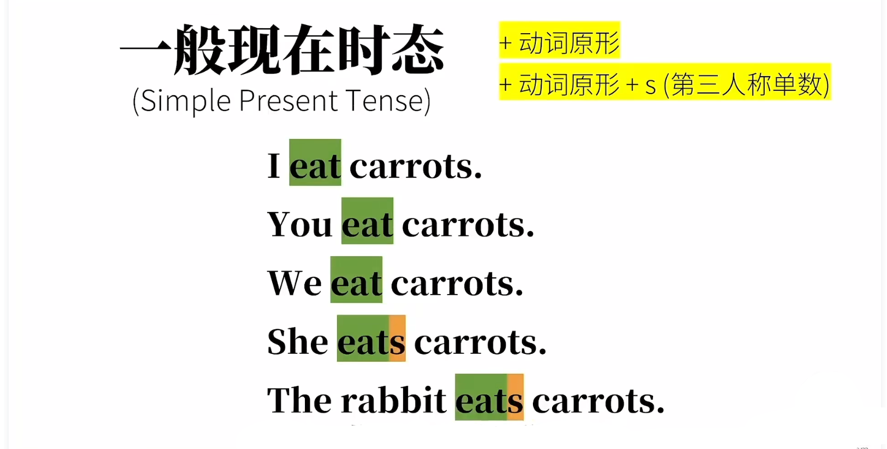

- 很多时候容易把**"现在"**时间和**"一般"**状态弄混淆

  - 一看到**"现在"**两个字，有的人就会本能觉得那一定是现在正在进行中的动作？

    但**I eat carrots(现在正在)**并不是，这里的**一般**可以理解为"默认的"，并没有特别指出的动作状态

    所以反而不太可能是正在进行的动作

    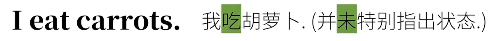

  - 现在时间这个时态，反而不是正在进行的动作？

  那就的了解一般现在时态最常见的三种情况：

  1. ### 表达事实

  - 比如在这里下面两句话中的 carrots，是复数，且前面没有冠词，这是"泛指"胡萝卜这类食物

  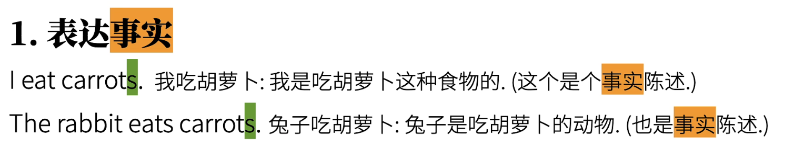

  - 这样的事实，不适合用其他状态，比如**进行，完成...**来描述，所以直接默认，一般情况。而这样的"事实"情况，除了没有状态限制，也没有时间限制。也就是说和**"现在"**没有特别大的关系

  - 如果我们直接使用**carrot**，**没有加上 s**的话，句子看上去好像没啥问题，但这句话想要表达什么意思？

    我们前面是有说，表达进行中状态的动作不用一般现在时态，而某只胡萝卜也不能让兔子天天吃，所以这句话就会很奇怪

    

  - 同样的案例类型还有这种：我去吃午饭

    > “I go to lunch” 在语法上是正确的，但在实际使用中，它确实可能会给人一种不自然或模糊的感觉。这是因为英语中的现在时通常用于描述习惯、常态或普遍真理，而不是描述正在进行的、即将进行的或一次性的动作。
    >
    > 让我们详细分析一下：
    >
    > 1. **习惯性动作**：当我们说 “I go to lunch at noon every day”，我们是在描述一个日常习惯或常规活动。这里，“I go” 是正确的，因为它描述的是一个经常发生的事情。
    > 2. **正在进行的动作**：如果你想描述你现在要去吃午餐的动作，你应该使用进行时：“I am going to lunch”。这样，听众会立刻知道你是在说你现在要去吃午餐。
    > 3. **即将进行的动作**：如果你想描述你很快要去吃午餐的动作，你可以说：“I am going to go to lunch”。
    >
    > 因此，当你只是说“I go to lunch”，而没有提供其他上下文（例如，“every day”或“usually”），听众可能会困惑，不知道你是在描述一个习惯还是一个正在进行或即将进行的动作。这就是为什么他们可能会问：“Do you mean you're going for lunch now?”来寻求更多的明确性。
    >
    > 总之，虽然“I go to lunch”在语法上是正确的，但在特定的情境中可能不是最佳的选择，因为它可能会导致模糊或误解。选择合适的时态可以帮助你更准确、清晰地传达信息。

    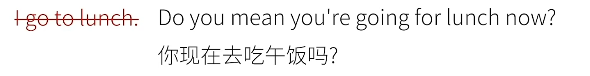

    那如果加个时间副词呢？

    ```js
    I eat a carrot now
    ```

    还是不对，因为 eat 在这里是一般现在时态，反而很少和"现在"(now)同时使用，而 now 往往和马上要讲到的现在进行时态一起使用。这个是需要注意的，这个问题不止是中文会有可能出错，其他语言也有类似的，都是属于不自然的英语

    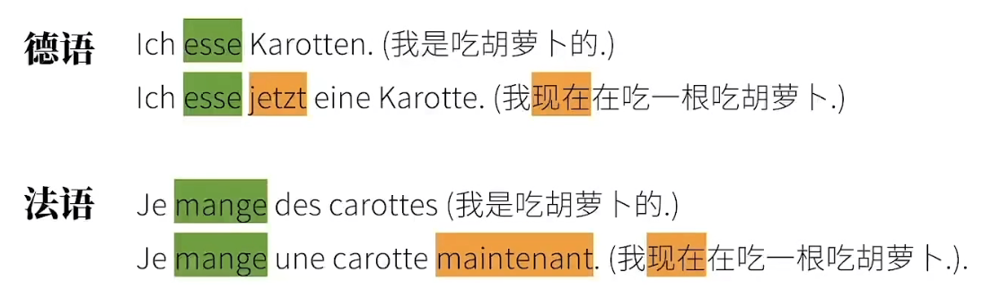

2. ### 表达习惯/重复的动作

   - 这个其实也可以归类到刚才说到的**表达事实**中

   比如下方的"我打篮球"，这里是习惯，所以不能用进行态或者完成态，只能用**一般态**

   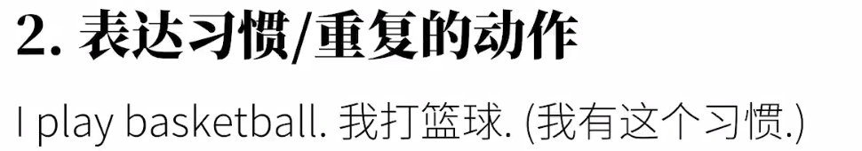

3. ### 表达预计发生的事

   比如**公交车今晚 8 点离站**，其实这句话也可以当作一个陈述句，一个事实。我们也可以再加上时间，把它改成"习惯/重复动作"，如：

   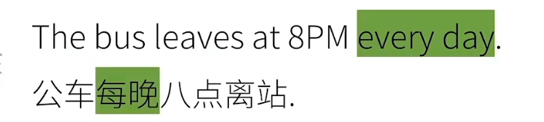

#### 现在进行时态

- 现在时间+进行状态很好理解，相当于中文中的**"正在做某事"**，它的构成是：

  助动词 be 的变位+动词的现在分词

  > 复习下**现在分词**的含义：
  >
  > - 现在分词是动词的一种非限定形式，用于描述正在进行的动作或状态。在英语中，现在分词通常以“-ing”结尾。
  >
  > 现在分词有多种用途：
  >
  > 1. **进行时**：与“be”动词（am, is, are, was, were）结合使用，描述正在进行的动作。
  >    - 例如：She **is reading** a book. (她正在读书。)
  > 2. **描述名词**：作为形容词描述名词。
  >    - 例如：The **running** water is cold. (流动的水是冷的。)
  > 3. **分词短语**：用于提供关于名词或代词的额外信息。
  >    - 例如：**Walking** in the park, I saw some beautiful flowers. (在公园散步时，我看到了一些美丽的花朵。)
  > 4. **作为名词**：在某些情况下，现在分词可以作为名词使用，这时它们通常被称为“动名词”。
  >    - 例如：**Swimming** is good for your health. (游泳对你的健康有益。)
  >
  > 现在分词的形成方式非常简单：大多数动词只需在其词尾加上“-ing”。但是，有些动词的拼写在添加“-ing”时会有所改变，例如**单音节动词**，如果其结尾是一个元音字母加一个辅音字母，通常会双写最后一个字母，如“run”变为“running”。

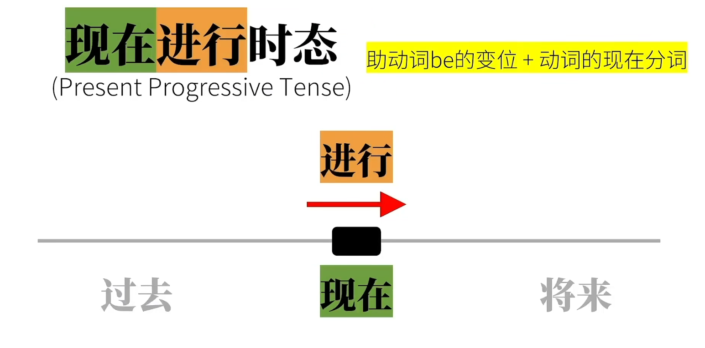

- be 这个动词有两个主要身份：

  1. (连)系动词，其实就是把之后的意思赋予给前面的词

  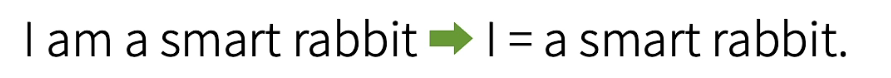

  2. 助动词，构成时态，以及被动态(这里暂时不讨论)。

     be 的动词变位，也就是改变拼写，为下面几种

     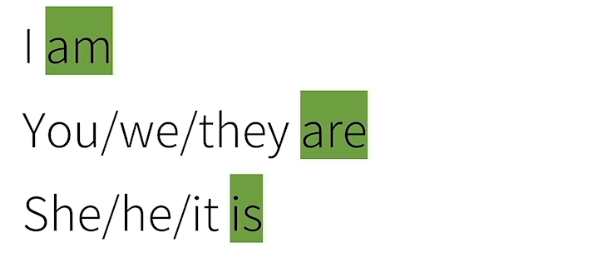

  - 前面也有复习了一下什么是现在分词，也就是通常在词尾+ing，像 looking(看)，smelling(闻)，tasting(尝)
  - 而有些动词要在此之上改变一下拼写，比如以下几种

  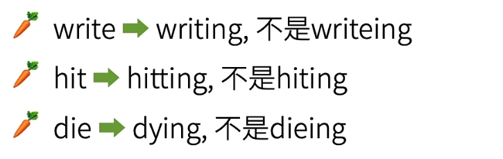

  - 为什么这么麻烦？但这样做是有道理的，因为这样的拼写是按照习惯发音的，如果不改变的话，不好发音容易造成误解，所以这样的"不规则"不是为了和我们过不去，或者为了让我们背诵额外的规则。其实英语很多所谓的"不规则"其实都有不按"规则"来的道理
  - 这个"动词的现在分词"，会在后面的非谓语动词部分还会讲到

  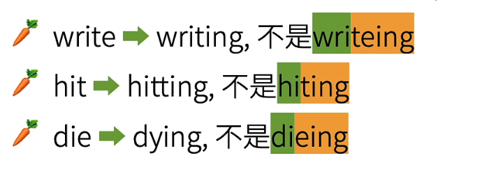

- 所以将刚才的 I eat carrots 改变成现在进行时态就是：

  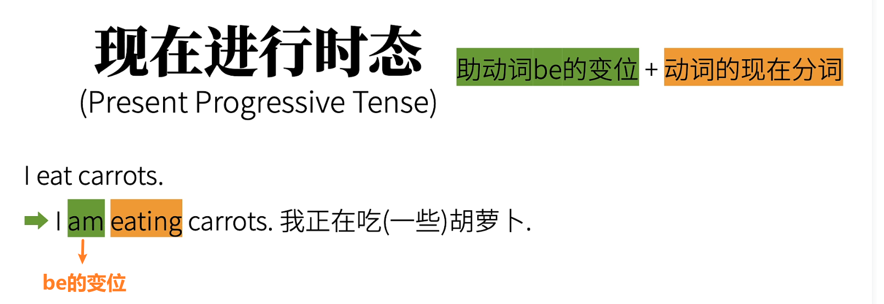

  - 更自然一点就是

  ```js
  I am eating a carrot
  //我正在吃一根胡萝卜
  ```

  其他人称：

  

#### 现在完成时态

- 前面有说完成态通常表达"已经"完成了的动作，往往还对现在造成影响

  - 比如：我已经吃掉了胡萝卜(暗示：后面就没得吃了)
  - 在中文中，有这样的表达方式：
    1. 我吃**过**胡萝卜
    2. 我**有**吃过胡萝卜，你**有**吃过胡萝卜吗？
  - 这里的**"有"**其实也是在表示动作完成的状态

- **现在完成时态的构成是：**

  - 助动词 have 的变位+动词的过去分词

  ### have 的两个主要身份

  1. 实义动词

     我有些"硬币"给这个视频 I have some coins for this video

  2. 助动词，构成时态

     have 的动词变位，也就是改变拼写，为： I/you/we/they/**have**

     She/he/it/**has**

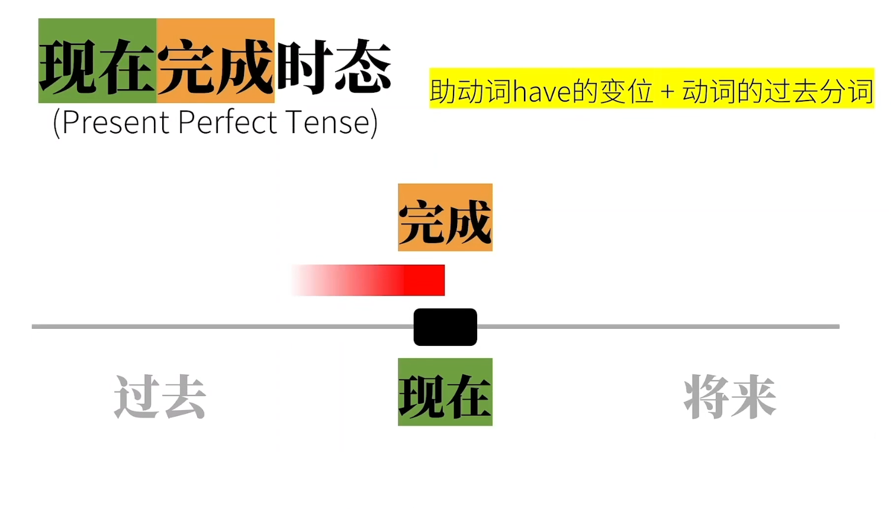

- ### 过去分词

  - 动词的过去分词通常在词尾＋ ed
  - 如：looked(看)，smelled(闻)，tasted(尝)

  但也有很多动词是所谓的"不规则变化"，不是在词尾＋ ed 那么简单。但也不是说完全无迹可寻

  1. 有通过在词尾+(e)n 的
  2. 还有都是词尾改成 ought 的
  3. 或者改一下拼写再＋ t

  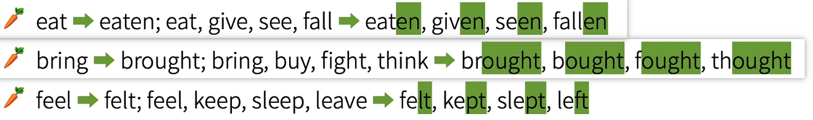

  - 我们也可以认为很多不规则变位只不过是少数动词符合某种规律的变位

- 另外还需知道的是，动词除了过去分词这种变位，还有一种变位叫做**过去式(Past/Preterit)**

  

  过去分词等下就会讲到，而动词的过去分词在非谓语动词部分还会涉及

  - 所以将 I eat carrots 改成**现在完成时态**就是如下：

    I + have 的变位 + eaten + carrots

  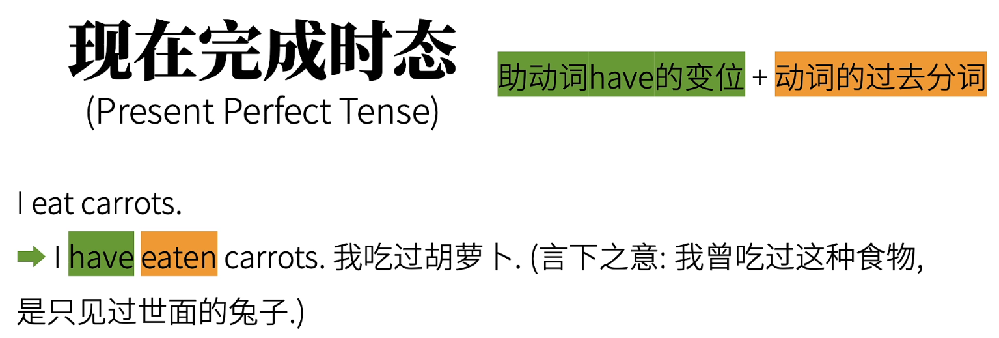

- 加上 a(一个)

  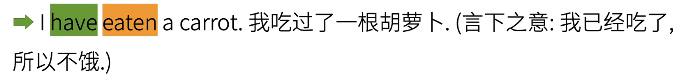

- 或者其他人称的主语：

  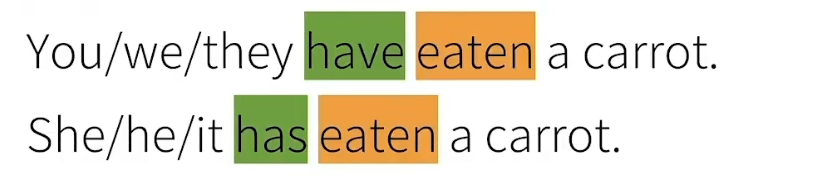

  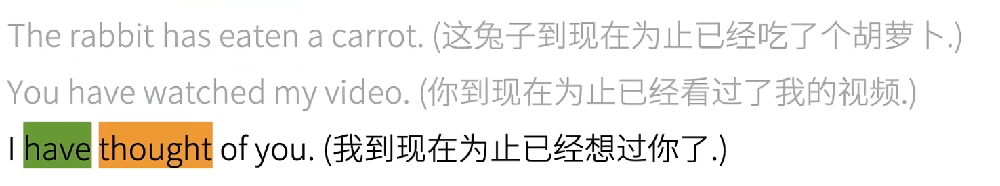

#### 现在完成进行时态

- **现在完成进行时态**，主要描述，对于现在这个时间点，不但已经完成了一部分，而且还要继续进行的动作

  前面也举过案例：我不但已经吃了一些胡萝卜，还要继续吃

  - 它的构成可以说是：进行态+完成态的综合

  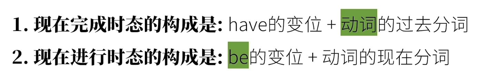

  两者的综合，其实就是把 2 中的 be 作为 1 中的动词。也就是说 1 中的"动词"是 be

  更进一步的说，2 中的 be 的变位 = 1 中的 be 的过去分词

  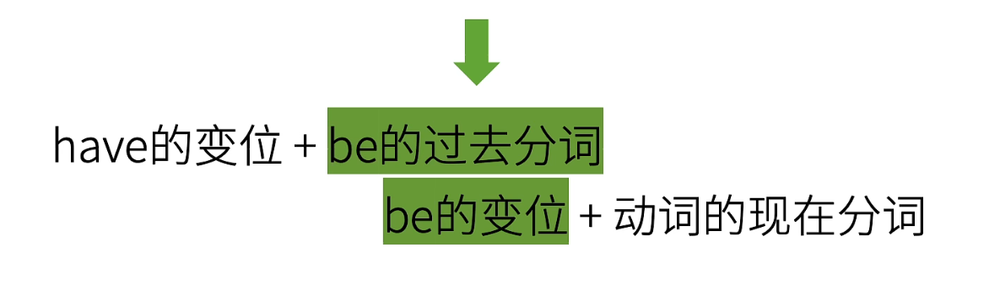

  - 这个只可能是 been

  - 所以**现在完成进行时态的构成：**

    have 的变位 + been + 动词的现在分词

  

- 我们来看一下，还是那句**I eat carrots**一般现在时态，如何修改为现在完成进行时态

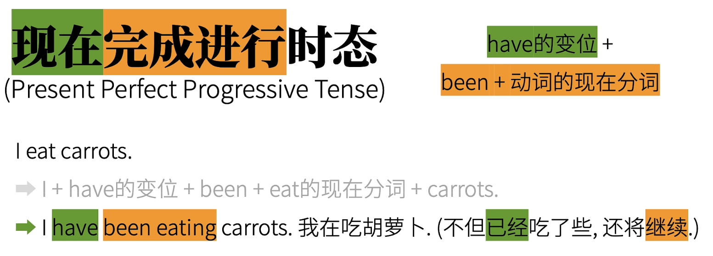

同样的案例还要以下几种：

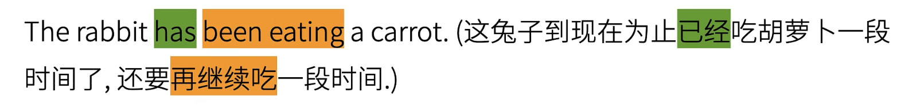

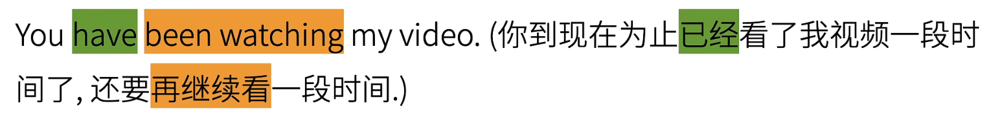

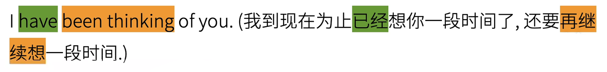

可以看出，完成进行时态的构成太简单了，就 been + 动词的现在分词。这里的 been 不管在什么人称里都是一样的

- 而且，只需要知道了动词的现在分词，连过去分词都不需要知道，就能表达完成进行时态

---

> 过去时间的四种时态，其实就是把现在时间的四种时态，往前推一个时间段而已

#### 一般过去时态

- 它其实就是一般现在时态往前推一个时间，**一般现在时态构成**是直接加动词原形，而**一般过去时态的构成**则是直接加动词的过去式，而且各个人称都是一样的

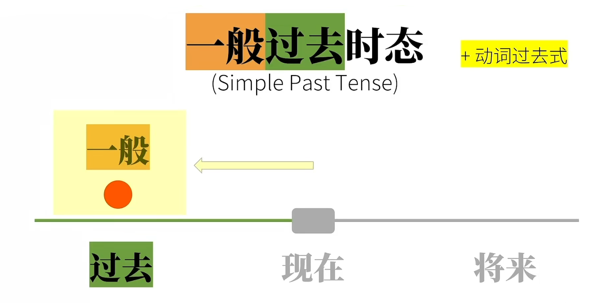

- 比如动词 eat 的过去式是 ate，下面不管什么人称都是使用一样的过去式，所以只需要知道动词的过去式，然后直接往主语后面加就完事了

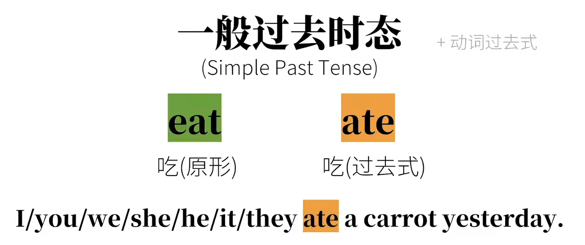

- #### 注意点:

  需要注意的是，千万不能把`动词的过去式`和之前`现在完成时态中提到的动词的过去分词`弄混淆，这两个不是一回事

  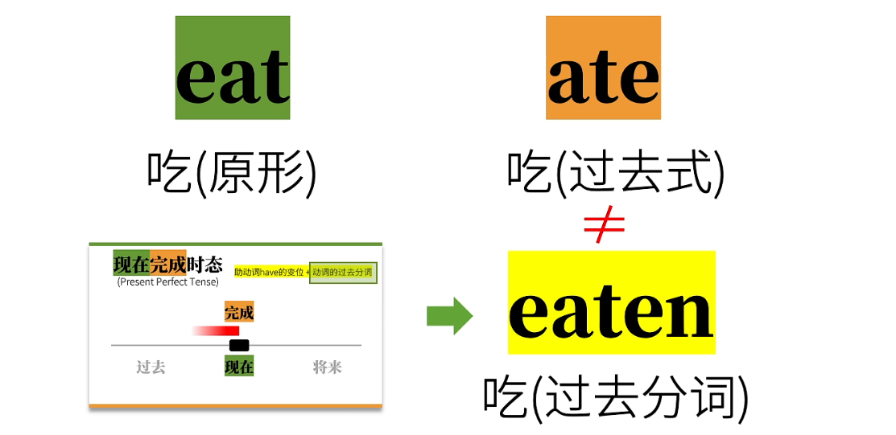

  > 比如例句：`I ate a carrot`(我吃了一个胡萝卜)，ate 是 eat 的过去式
  >
  > `I have eaten a carrot`(现在完成时态)，eaten 是 eat 的过去分词

- 另外，动词的**过去式**也不要和时态的过去时弄混淆，过去式时动词的一种形式(变位)

- **过去时**是指过去这种时间，里面有四种时态

  - 前面有很多动词的过去分词有些变化规则(词尾+ed)，有些变化不规则，那动词的过去式，莫非也是这样？

    yes，也是这样的

  - 很多动词的过去式是规则变化，而且也是在词尾+ed，像 looked(看)、smelled(闻)、tasted(尝)...它们的过去分词和过去式都是+ed

    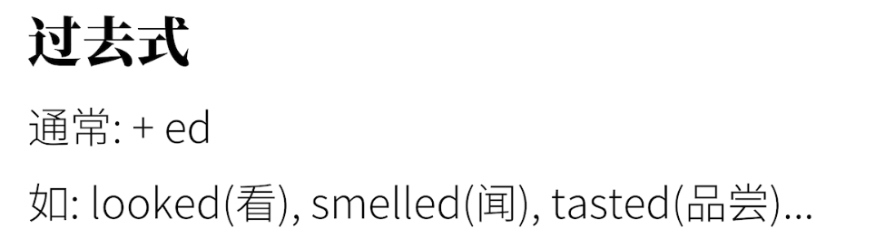

  - 但也有一些动词的过去分词和过去式都和动词原形不一样的

  | 动词原形 | 动词过去式 | 动词过去分词 |
  | -------- | ---------- | ------------ |
  | do       | did        | done         |
  | go       | went       | gone         |
  | take     | took       | taken        |

  英语中，有些像以上这样特别常用的动词，时态变位可以说完全不规则，没啥规律。不过由于梳数量不多，而且常用，所以记忆还是相对容易的

  - 也有一些，虽然属于不规则变化，比如下方的几种，但是实际上它们也是有同类的

  | 动词原形 | 动词过去式 | 动词过去分词 |
  | -------- | ---------- | ------------ |
  | bring    | brought    | brought      |
  | blow     | blew       | blown        |
  | begin    | began      | begun        |
  | speak    | spoke      | spoken       |

  - 也就是算是属于有规律可循的：

  | 动词原形 | 动词过去式 | 动词过去分词 |
  | -------- | ---------- | ------------ |
  | bring    | br`ought`  | br`ought`    |
  | buy      | b`ought`   | b`ought`     |
  | fight    | f`ought`   | f`ought`     |

  | 动词原形 | 动词过去式 | 动词过去分词 |
  | -------- | ---------- | ------------ |
  | blow     | bl`e`w     | blow`n`      |
  | grow     | gr`e`w     | grow`n`      |
  | know     | kn`e`w     | know`n`      |

  | 动词原形 | 动词过去式 | 动词过去分词 |
  | -------- | ---------- | ------------ |
  | begin    | beg`a`n    | beg`u`n      |
  | sing     | s`a`ng     | s`u`ng       |
  | swim     | sw`a`m     | sw`u`m       |

  | 动词原形 | 动词过去式 | 动词过去分词 |
  | -------- | ---------- | ------------ |
  | speak    | sp`o`ke    | sp`o`k`en`   |
  | freeze   | fr`o`ze    | fr`o`z`en`   |
  | choose   | ch`o`se    | ch`o`s`en`   |

- ### 一般过去时态怎么用呢？

  - 过去时间好懂，那过去时间轴的"一般"状态时怎么回事？

    其实我们可以把这个一般状态，想成单纯地指出有个动作发生了而已，至于这个动作发生了多久、什么时候开始、什么时候结束，如果没有上下文的话，就不得而知

    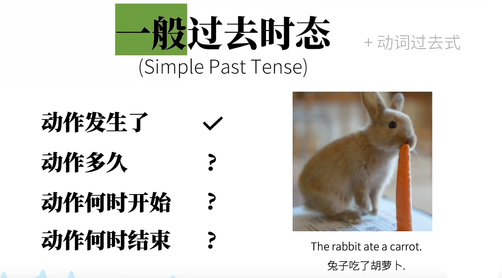

  - 可以把一般过去时态想象成一张照片，如上图的**兔子吃了胡萝卜**，我们看到了这张照片，在这里，我们只知道这兔子过去某个时刻在吃胡萝卜

    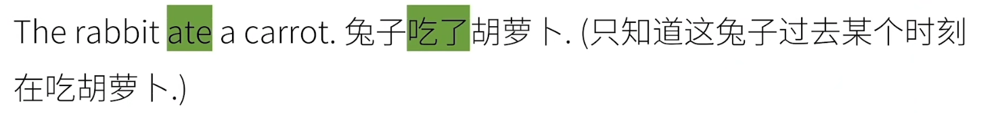

    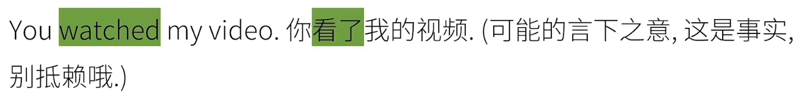

    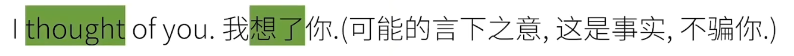

- 一般现在时态可以表达"习惯动作"，但一般过去时态这方面就欠缺了

  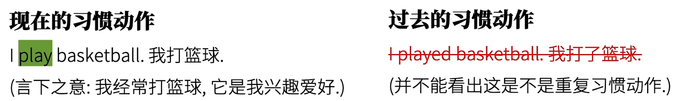

  这时候就需要用到词组：

  I **used to play** basketball 我曾经常

  打篮球

#### 过去进行时态

- 某些动作需要持续一段时间的，比如**吃**这个动作不可能是瞬间的，必然有一个过程。

  - 但一般过去时态的注意点不在过程，只是单纯强调这事发生了还是没发生
  - 如果我们想要强调过去某个时间段，某个动作是当时进行中的，那我们就需要用到过去进行时态

  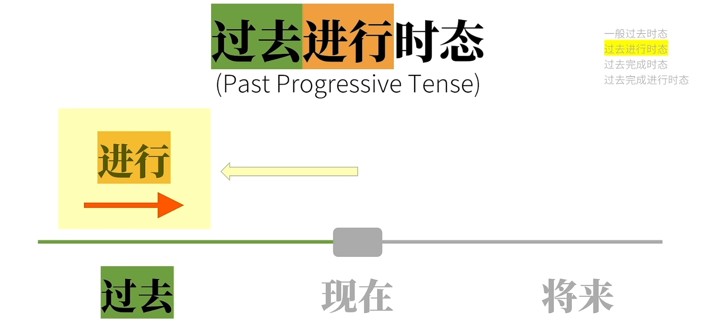

  那**过去进行时态**的构成是怎么样的？

  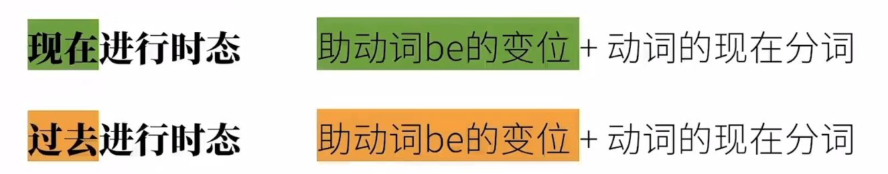

  - 看似和现在进行时态一样，但其实不然。**过去进行时态**中的助动词 be 的变位需要考虑到时间了

  - 助动词 be 在过去时间的变位其实就是 be 的过去式，之后为了表示进行状态中的现在分词(其实叫做**"进行分词"**可能更合适一些)

    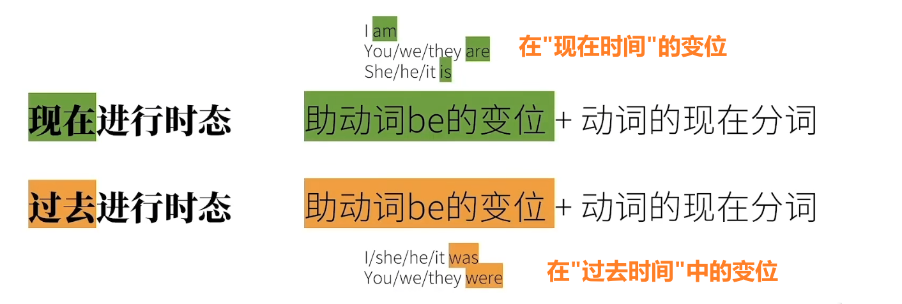

    - **过去进行时态**只需要在**现在进行时态**的基础上把 be 改成过去式就可以了，如下例子：

    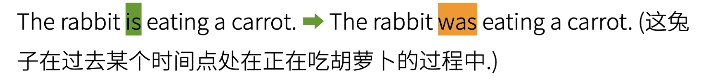

    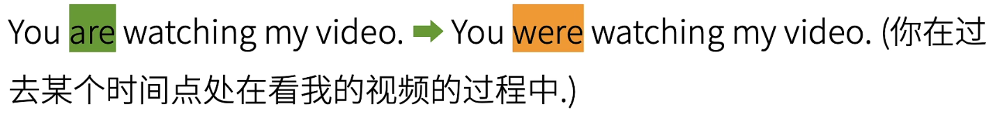

    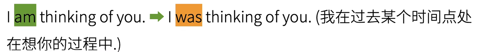

- 有个问题，之前说的现在完成时态描述了已经完成的动作(那就肯定是过去时间里做的)，这里两个过去时间里的时态(一般过去、过去进行时态)也是在说**过去动作**，所以说三者都有过去动作的信息，那三者有什么区别？


- 回忆一下这三者：

  1. 现在完成时态：说的是对于现在这个时间点而言，某个动作是否已经完成。

     重点：**某个动作是否已经在说这句话之前完成了？**

     - 所以往往考虑的是某个过去的动作对现在的影响

  2. 一般过去时态：重点在于描述某一个动作到底在过去有没有发生，所以往往考虑的是过去的事实

     所以过去和现在之前的联系是很微妙的，如：

     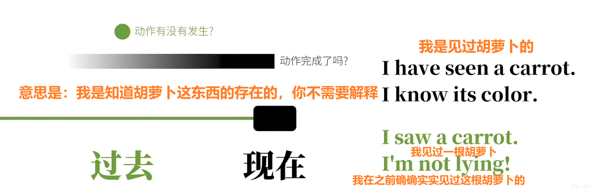

     > - 句子 1：我已经去了上海，所以对现在有影响，人不在"这里"了。意思就是我已经去上海了，没有停留在原地了，你如果没来上海的话是找不到我的了，所以这句话一定是和看不到我人的人说的。**换句话说，就是这句话是不能面对面和别人说的**，如果面对面对别人说"我已经去了上海"，别人肯定满脑子冒号的，想：你人不是在我面前嘛？
     >   - **I have gone to Shanghai**
     > - 句子 2：这句话多半暗示我已经从上海回来了，跟句子 1 不同，这句话是当面说的，重点不在对现在的影响，我只是单纯指出**我曾经去了上海**这件事
     >   - **I went to Shanghai**

  3. 区分**过去进行时态**和**一般过去时态**可以这么联想：过去进行时态是一个视频，一般过去时态则是一张照片

     - 视频是动态的，视频里记录的是过去中正在发生的事情
     - 而照片是静态的，记录的是过去发生的一件事情

#### 过去完成时态

- 过去完成时态其实就是**现在完成时态**往前推一个时间段
- 和**现在完成时态**的组成貌似一样，但助动词 have 的变位则需要考虑到**时间**

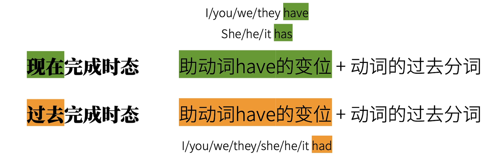

- 在过去的全部人称都变成了**had**
  - 其实，助动词 had 在过去时间里变位就是 have 的过去式(只有一个)而已，之后的为了表示完成状态中的**过去分词**还是不变，因为也是表示完成状态
- 过去完成时态就主要为了表达：过去某一点(A)的过去(B)对过去那一点(A)的影响

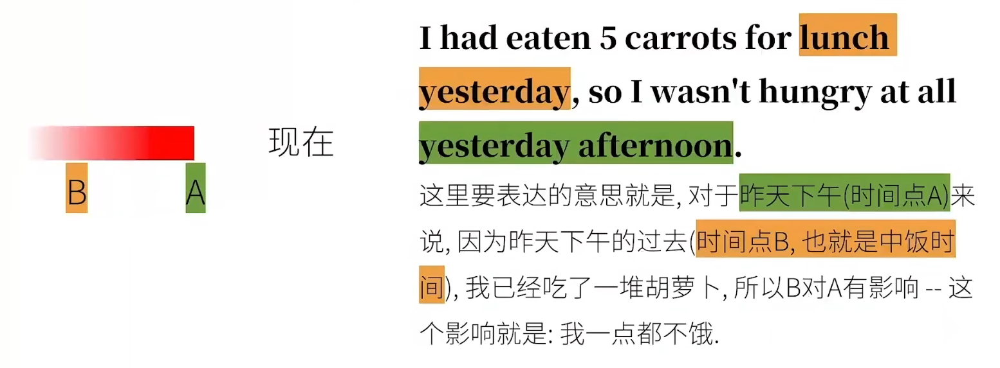

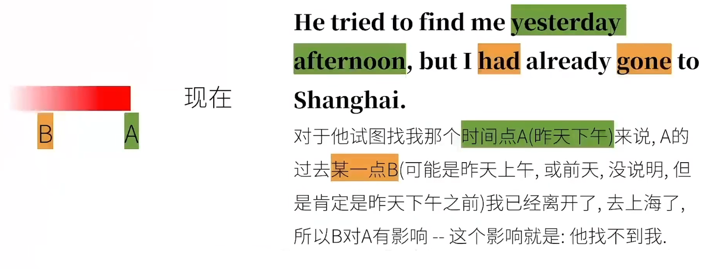

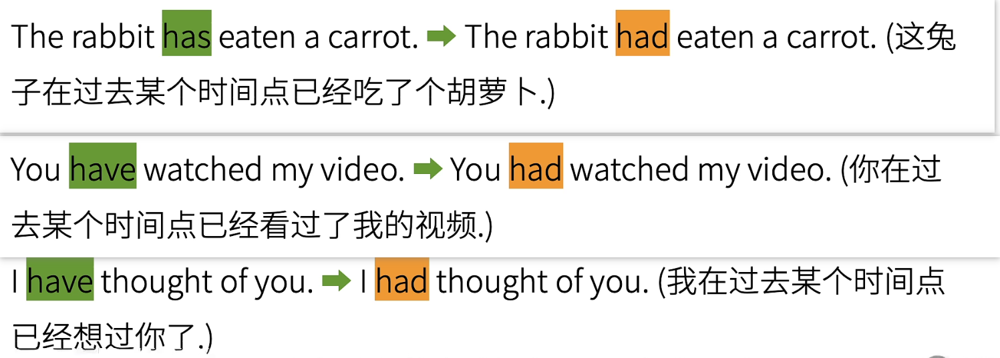

#### 过去完成进行时态

- **过去完成进行时态**其实就是**现在完成进行时态**往前推一个时间段，现在完成进行时态描述，对于现在这个时间点，不但已经完成了一部分，而且还要继续进行的动作

- 那么过去完成进行时态自然是描述，对于过去某个点，不但已经完成了一部分，而且还要继续进行的动作

  比如：直到昨天下午 3 点钟，小余已经打了 3 小时的游戏了，而且没有停下来的打算

- **过去完成进行时态**的构成：

  和**现在完成进行时态**一样一样的，但助动词 have 的变位一样需要考虑到时间了

  但实际上的共通之处是很多的，理解起来还是比较简单的

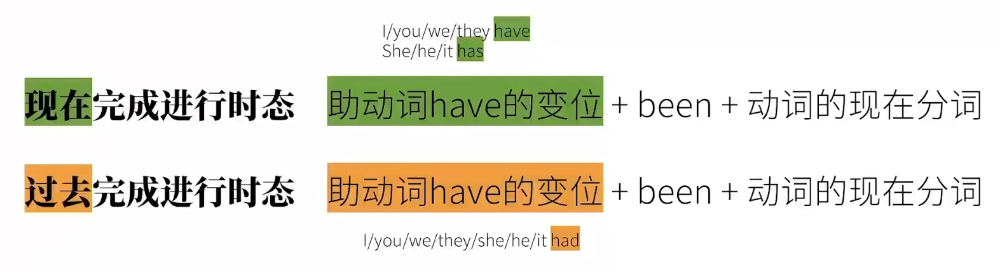

- ## 例子

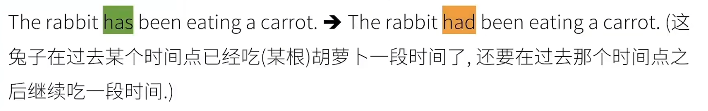

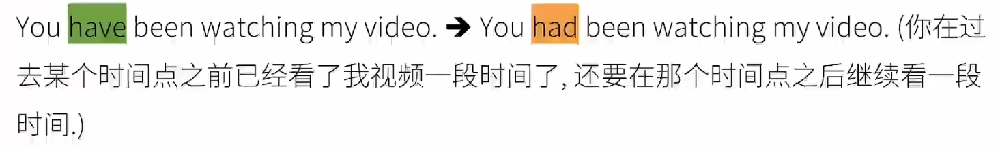

---

- 将来时间的四种时态，其实就是把现在时间的四种时态，往后推一个时间段而已
- 其他外语(不是英语)对于动词一般状态的三种时间

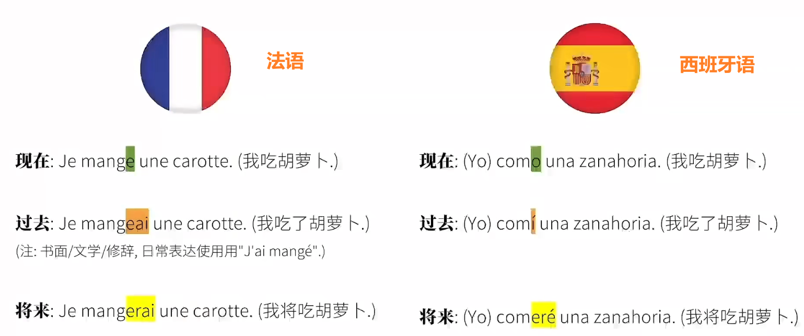

- 法语和西班牙语这两种语言都属于"罗曼语族"，它们动词表达将来时态时，动词本身就有变位(词尾拼写改变)，所以往往我们看到词尾，往往就知道是什么时态

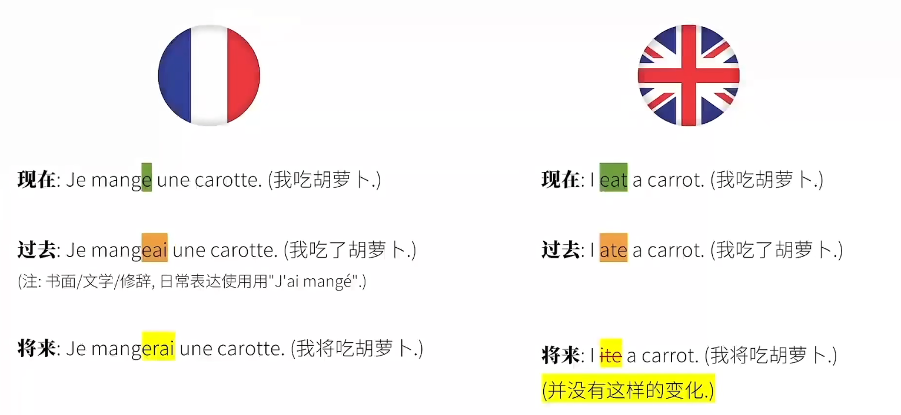

- 但是英语以及德语属于"日耳曼语族"，要表达将来时态，动词本身并没有相应的像过去式，比如词尾+ed 这样的拼写变化

- 英语中要表达**将来**也必须要借助到助动词，放到主动词(谓语动词)之前

  - 这个将来时态里用到的助动词就是：will，有时也会用 shall

  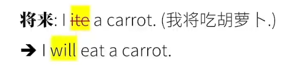

  - 所以有的人会认为英语的动词本身根本就没有"将来时态"。有的仅仅是**"将来时态的表达"**，而且这样的表达有好几种

  > ## 英语表达将来时态
  >
  > 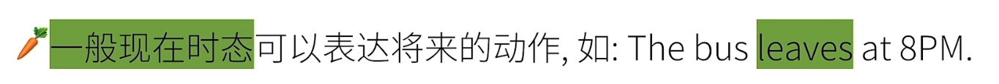
  >
  > - 上面这个**一般现在时态**其实是在描述将来的事情，只不过我们把它当作"事实"来描述
  >
  > 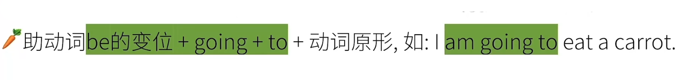
  >
  > - 这句话不是说我回去某个地方吃胡萝卜，而是我"(很快)将要"吃胡萝卜
  >
  > 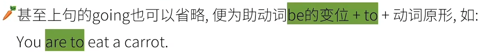
  >
  > - 这就有点命令的意味了
  >
  > 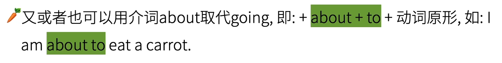
  >
  > - 或者是这样，翻译为我将要吃根胡萝卜

- 接下来，我们要写上几种最"普通正常"的，用助动词 will 实现的几种将来时态

#### 一般将来时态

- 构成：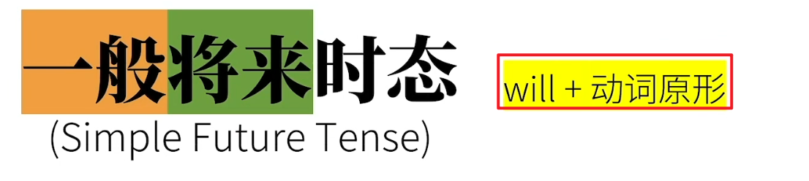
- 好消息是这个一般将来时态的构成中，在所有人称中都是 will

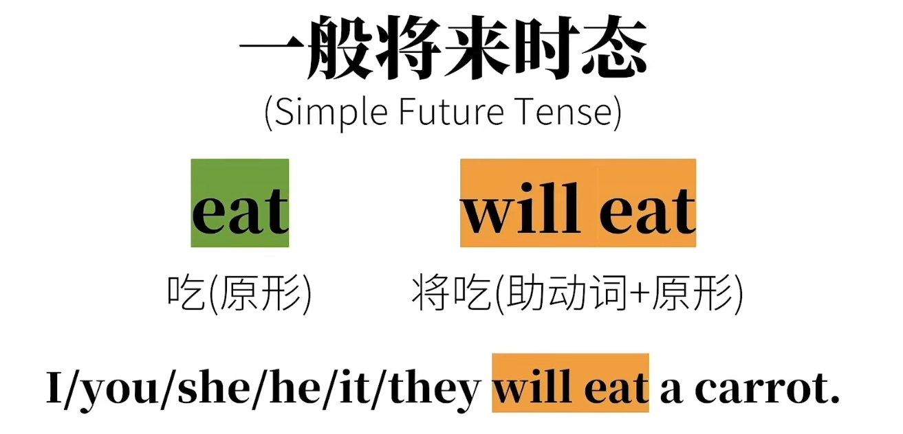

- 描述：**将来某个时间点发生的动作**

  - 和"一般过去时态"正好"相反"(时间上)

  - 如果我们认为：**将来的事情，谁能够说得准呢？**

    所以，`将来时态是描述说话者十分确认会发生的事情`

    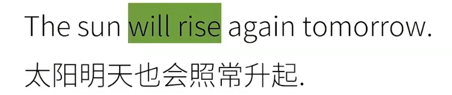

- 如果我们不太确定某事在将来会发生，就不能用这个一般将来时态了，我们就需要借助动词的另一个本领，也就是**动词的"语气"**

#### 将来进行时态

- 其实就是**现在进行时态**往后推一个时间段
- 而**将来进行时态**的`构造`也能够和现在进行时态进行一个对比：

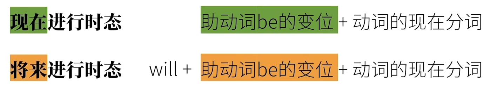

- **将来进行时态**也是在之前加上助动词 will，而因为 will 以及算是变位过的助动词(虽然它在每个人称里都一样是 will)，所以之后的助动词 be 就不用再变位了，保持原形就行

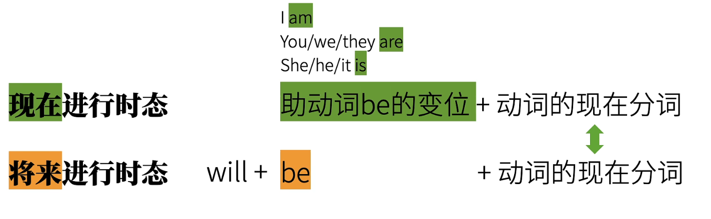

- 将来进行时态要表达的意思就是：**在将来某个时间，某个动作是在进行的过程中**

  - 甚至我们可以加上其时间信息进行更精准的确认

  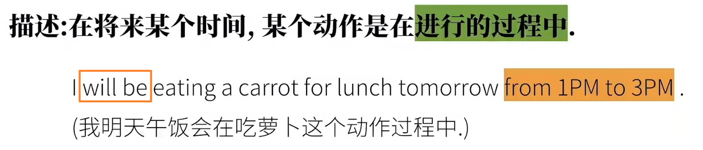

  - 我们在加上时间信息的时候，我们甚至可以感觉出来**将来进行时态**比**一般将来时态**还要笃定，所以当我们特别确定某个动作/事件一定会发生时，就可以考虑使用将来进行时
  - 一样可以将其理解为一张图片(静态)和一个视频(动态连续)

#### 将来完成时态

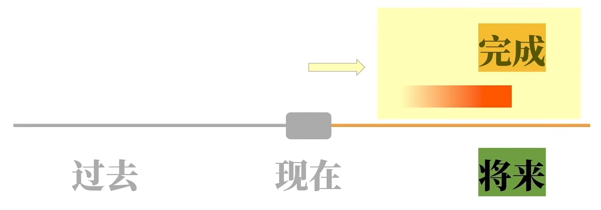

- 让我们来看看**将来完成时态**和**现在完成时态**的区别又在哪里？

  - 多了一个 will，也就是将来完成时态要在前面加上助动词 will。而因为 will 以及算是变位过的助动词，所以之后的助动词 have 就不用变位了

  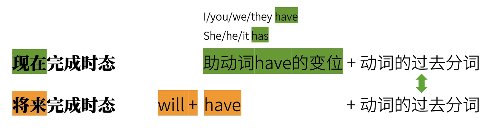

  - 现在完成时态是为了表达对现在的影响，那就能够倒退**将来完成时态**的作用是：

    > **为了表达对将来某一点(A)的过去(B)和现在的前后不确定的对将来那一点(A)的影响**
    >
    > - 将来完成时态通常用于描述在将来某一特定时间点之前将已经完成的动作。换句话说，它描述了一个在将来某时之前开始并完成的动作。例如，"到明天这个时候，我会已经完成我的作业。" 在这句话中，完成作业的动作是在明天这个时候之前发生的。
    >
    > 1. **对将来某一点(A)的过去(B)**：这里的 A 是指将来的某一特定时间点，B 是指在那个时间点之前发生的动作。例如，在句子 "到 2025 年，我会已经结婚五年了。" 中，2025 年是 A，结婚这个动作是 B，这个动作在 2025 年之前已经发生了。
    > 2. **现在的前后不确定的对将来那一点(A)的影响**：将来完成时态表示的动作不仅仅是在 A 之前完成的，它也对 A 产生了某种影响或结果。继续使用上面的例子，到 2025 年，我与我的伴侣已经共度了五年的时光，这五年的经历可能对我在 2025 年的状态或情况产生了影响。

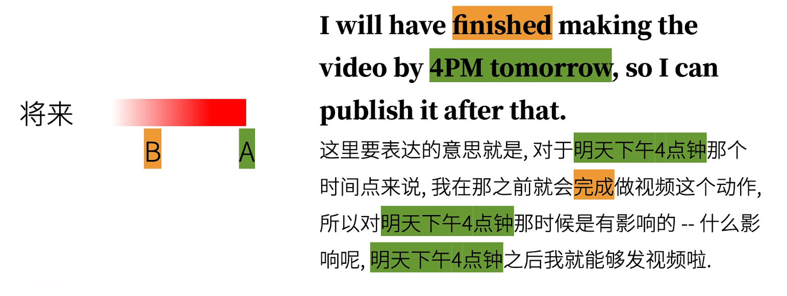

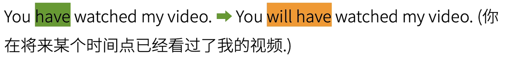

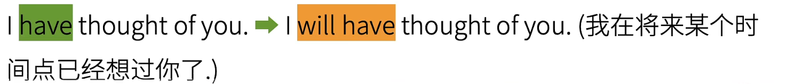

#### 将来完成进行时态

- `将来完成进行时态`其实就是`现在完成进行时态`往后推一个时间段

  - 跟前面一样，一样是加上 will 且因为 will 已经算变位过了，后面的 have 不需要变位

  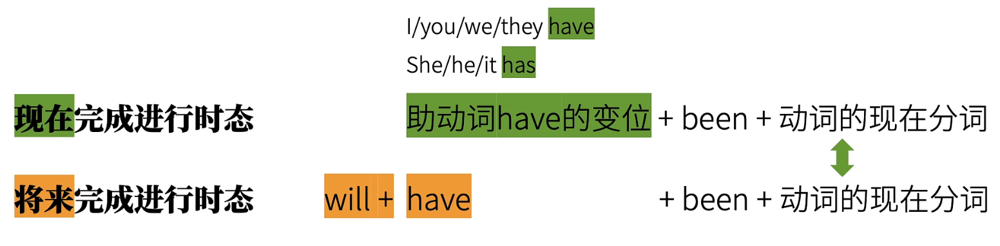

- **现在完成进行时态**对于现在这个时间点，不但已经完成了一部分而且还要继续进行的动作

- 那么**将来完成进行时态**自然是描述，对于将来某个点，不但已经完成了一部分，而且还要继续进行的动作

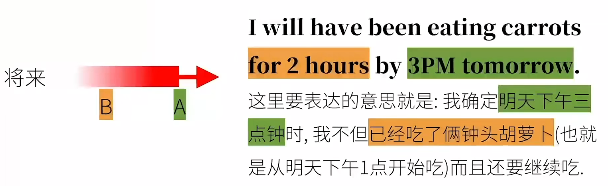


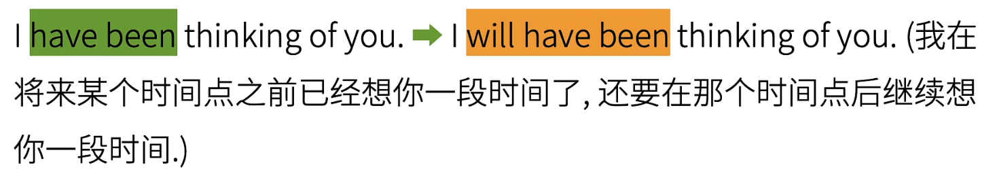

- 这个时态在平时其实很少用到，因为它表达的意思真的是特别的具体，而通常用`一般将来时态`或者`将来进行时态`，已经可以表达相似情况。
- 所以我们发现**助动词 will 出现在所有 4 个将来事件的时态里**，will 本身在每个人称里都是 will(可以视作不用变位)，而一旦使用了 will，则之后的助动词 have 也不用变位，保持原样就行，而助动词 be 要么是原形，要么在 have 后面是 been，再之后直接就是现在分词

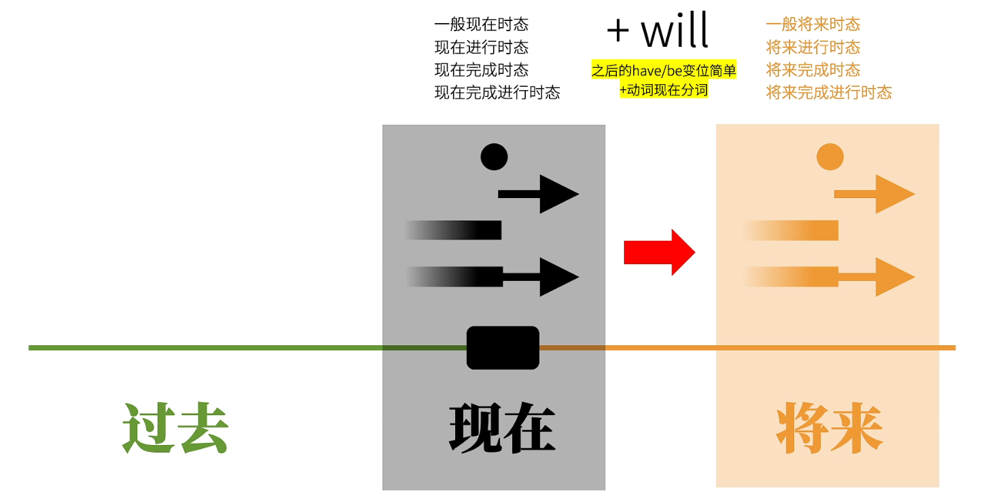

---

#### 过去将来时态

- 听上去有点费解，过去和将来不是冲突的吗？

  - 如果都按照现在的时间点为锚点进行参照的话，那确实就是冲突矛盾的。但是这里的`"将来"`是说：相对过去某一时间点的将来
  - 比如说：我去年说过我上个月要开始自律学习了。那么上个月对于去年来说就是`"过去将来"`，只不过对于现在来说还是过去

  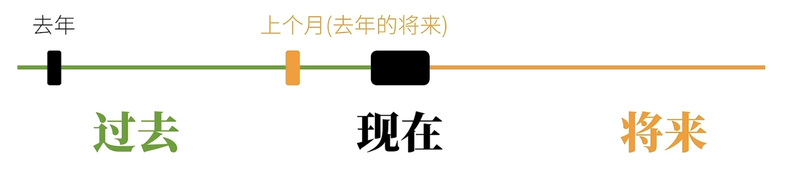

  - 但如果我们这么说：**我上个月说我明年要找实习**，那明年对于上个月来说是`"过去将来"`，而正好也是现在的将来

- 所以我们所说的**"过去将来"**其实和**现在**没啥关系

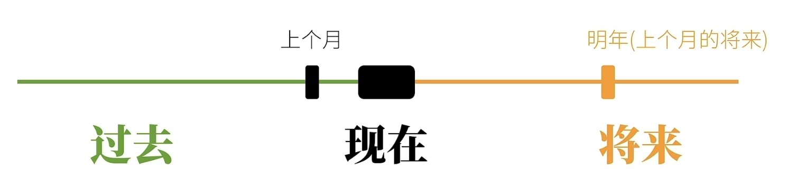

- 这种过去将来时态更经常出现于过去时态的从句中，也就是说从主句"朝后推"一个时态。这部分的内容再后面的从句笔记中会详细写
- 其实，过去将来这四种时态，只不过是把将来时间的四种时态往前推一个时间段(推到现在的过去)而已

#### 一般过去将来时态

- 一般过去将来时态的构成：
  - 将 will 进行过去式的变位，变成 would

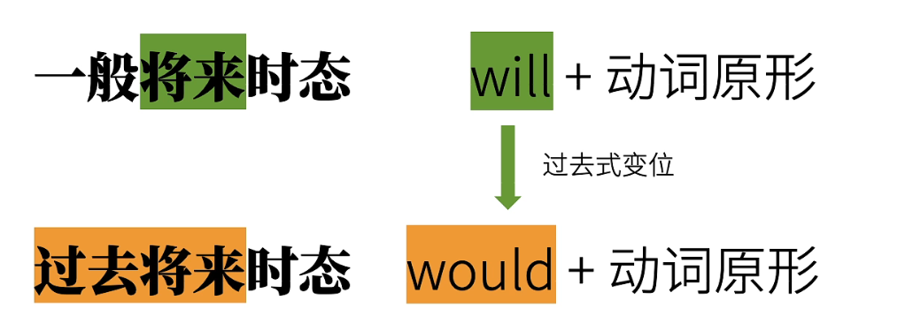

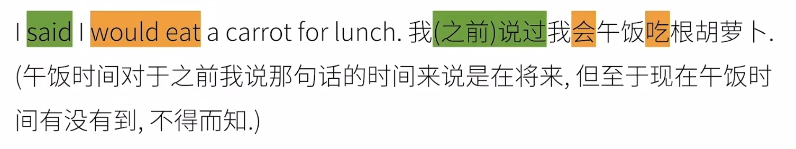

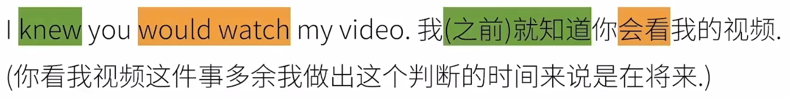

- 我们之前在将来时态中还提到了，英语表达"将来"还常用：**助动词 be 的变位+going+to+动词原形**。这样的结构也可以构成过去将来时，只不过需要把助动词 be 变位体现过去

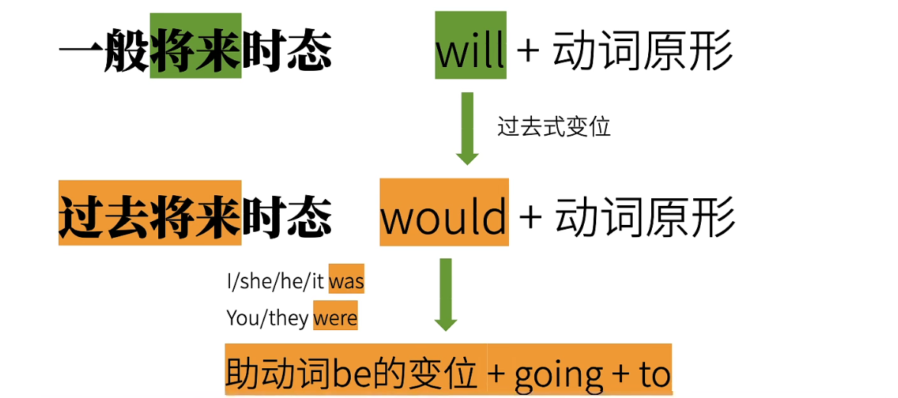

- 之前的两句话就变成如下：

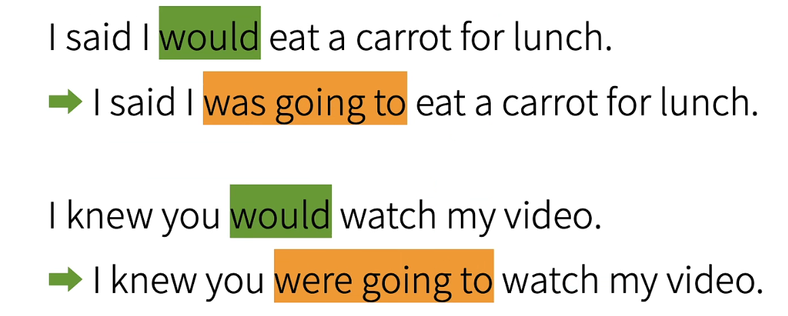

##### would 的多义

- 这个词有很多不同的用法，在这里是用作 will 的过去式，来构成过去将来时态


- 但也可以用在动词的虚拟语气里，表达和事实相反。下面也是表达在这种不可能的情况中，我"会"吃胡萝卜，这里没有"过去将来时态"的含义

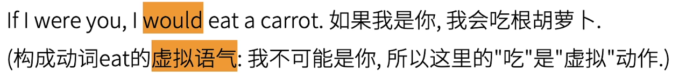

- 平时未来表示礼貌，我们也会这样说：

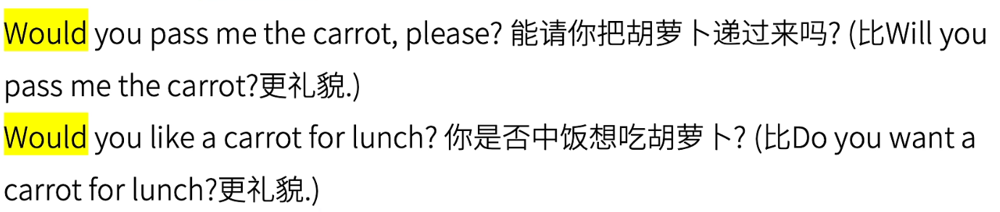

#### 过去将来进行时态

- 过去将来进行时态构成：

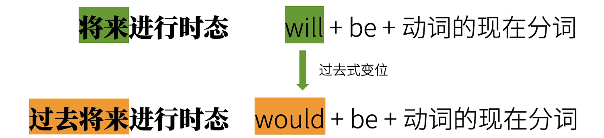

- 例句：

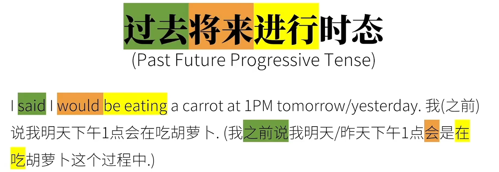

#### 过去将来完成时态

- 过去将来完成时态的构成：

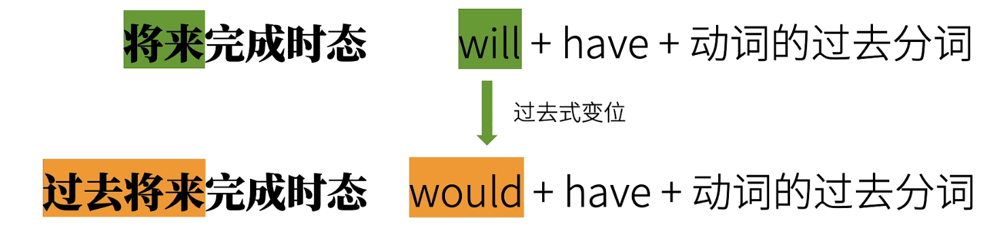

- 例句：


#### 过去将来完成进行时态

- 过去将来完成进行时态的构成：

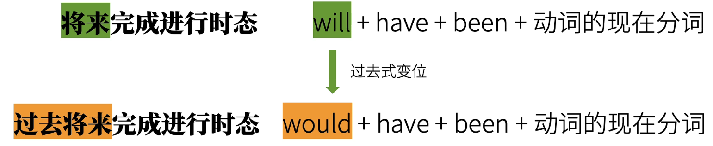

- 例句：

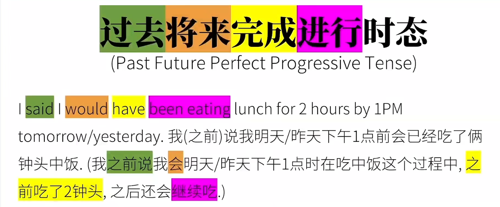

### 总结

- 虽然"理论上"英语有 16 钟时态，但是有些并不常用，有些甚至是非常不常用
- 以下有颜色的部分是常用的部分：

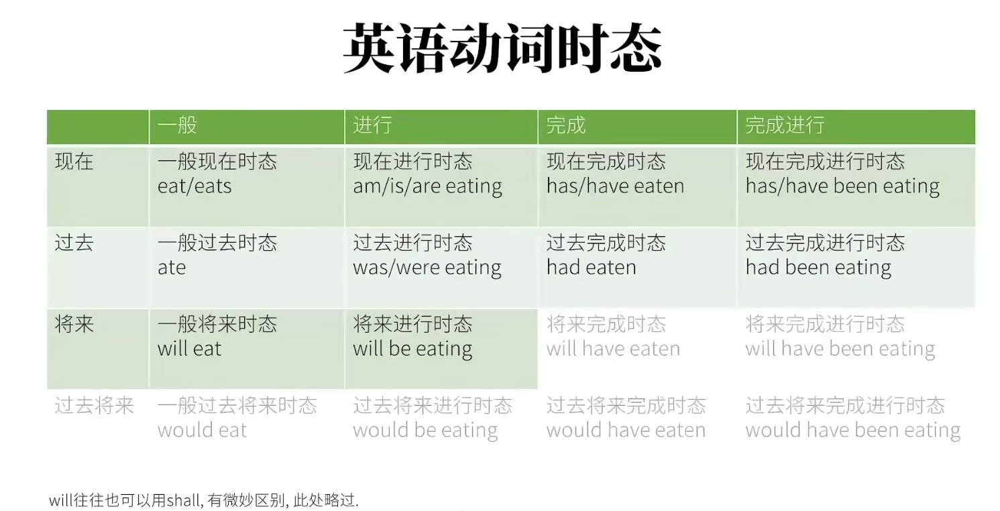

- 并且像将来时间用 will，连变位都不用背

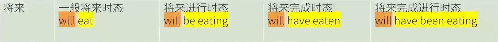
